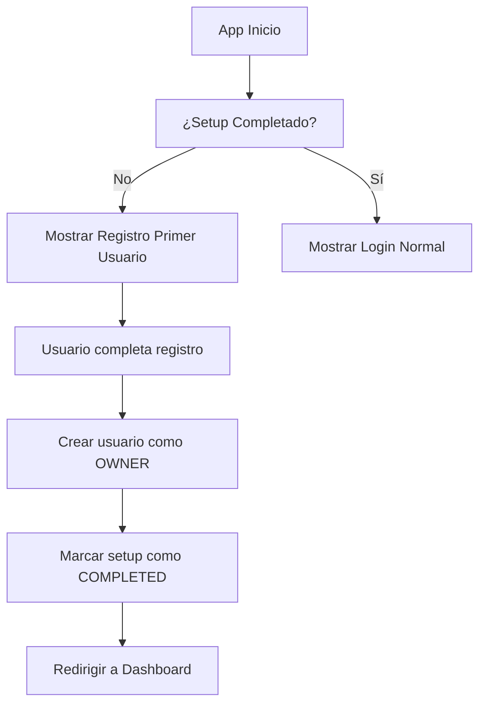
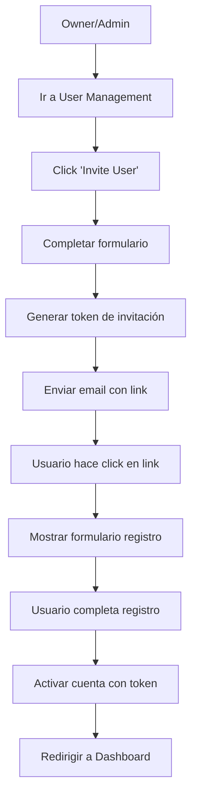

# Sistema de Usuarios Silhouette - Estilo n8n

## Descripción General

Silhouette implementa un sistema de usuarios similar a n8n para instalaciones auto-hospedadas, donde:

- **El primer usuario se convierte automáticamente en "Owner"** (administrador permanente)
- **Solo el Owner puede invitar colaboradores** al sistema
- **Usuarios adicionales requieren invitación** del Owner o Admin
- **Control granular de permisos** basado en roles
- **Base de datos SQLite** para almacenamiento local

## Características Principales

### 🏠 Instalación Self-Hosted
- **Primer Usuario = Owner Permanente**: El primer usuario registrado se convierte en Owner automáticamente
- **Sin Self-Registration después del setup**: Una vez creado el primer usuario, no se permiten más registros libres
- **Invitaciones controladas**: Solo Owners/Admins pueden invitar nuevos usuarios

### 👥 Gestión de Usuarios
- **Roles**: Owner, Admin, Member, Viewer
- **Invitaciones por Token**: Enlaces de invitación con expiración de 24 horas
- **Verificación de Email**: Sistema de verificación integrado
- **Autenticación JWT**: Tokens seguros con expiración de 7 días

### 🔒 Seguridad
- **Password Hashing**: bcrypt con salt rounds de 12
- **Two-Factor Authentication**: Preparado para 2FA
- **Session Management**: Control de sesiones activas
- **Password Policies**: Mínimo 8 caracteres

## Estructura de Base de Datos

### Tablas Principales

#### `users`
```sql
- id (UUID, Primary Key)
- email (String, Unique)
- firstName (String)
- lastName (String)
- password (String, hashed)
- role (ENUM: owner, admin, member, viewer)
- status (ENUM: active, invited, suspended, deleted)
- isFirstUser (Boolean) -- Flag especial para el primer usuario
- invitedBy (UUID) -- Quién invitó a este usuario
- inviteToken (String) -- Token de invitación
- inviteExpires (DateTime)
- emailVerified (Boolean)
- twoFactorEnabled (Boolean)
- lastLoginAt (DateTime)
```

#### `instance_settings`
```sql
- id (UUID, Primary Key)
- setupStatus (ENUM: not_started, in_progress, completed)
- firstUserId (UUID) -- Referencia al primer usuario
- userManagementEnabled (Boolean)
- allowSelfRegistration (Boolean)
- allowEmailInvites (Boolean)
- smtpHost, smtpPort, smtpUser, smtpPassword
- authProvider (ENUM: local, saml, ldap, oidc)
```

#### `project_relations`
```sql
- id (UUID, Primary Key)
- projectId (String)
- userId (UUID)
- role (String) -- Rol específico del proyecto
```

#### `shared_credentials`
```sql
- id (UUID, Primary Key)
- credentialId (UUID)
- userId (UUID)
- accessLevel (ENUM: read, write, admin)
```

#### `shared_workflows`
```sql
- id (UUID, Primary Key)
- workflowId (UUID)
- userId (UUID)
- accessLevel (ENUM: read, write, admin)
```

## API Endpoints

### 🔐 Autenticación

#### `POST /api/auth/register`
Registra el primer usuario o un usuario regular
```json
{
  "email": "user@example.com",
  "firstName": "John",
  "lastName": "Doe",
  "password": "securePassword123"
}
```

#### `POST /api/auth/login`
Inicia sesión de usuario
```json
{
  "email": "user@example.com",
  "password": "securePassword123"
}
```

#### `POST /api/auth/accept-invitation`
Acepta una invitación usando token
```json
{
  "token": "invitation_token_here",
  "password": "securePassword123"
}
```

### 👥 Gestión de Usuarios

#### `POST /api/auth/invite` (Owner/Admin only)
Invita un nuevo usuario
```json
{
  "email": "newuser@example.com",
  "firstName": "Jane",
  "lastName": "Smith",
  "role": "member"
}
```

#### `GET /api/auth/users` (Owner only)
Obtiene todos los usuarios del sistema

#### `GET /api/auth/invited-users` (Owner/Admin only)
Obtiene usuarios invitados por el usuario actual

#### `GET /api/auth/setup-status`
Obtiene el estado de configuración de la instancia

## Flujo de Setup Inicial

### 1. Primera Instalación


### 2. Invitación de Usuarios


## Configuración de Instalación

### Variables de Entorno
```bash
# JWT Secret (importante para seguridad)
JWT_SECRET_KEY=your-super-secret-jwt-key

# Frontend URL para links de invitación
FRONTEND_URL=http://localhost:3000

# SMTP Configuration (opcional pero recomendado)
N8N_EMAIL_MODE=smtp
N8N_SMTP_HOST=smtp.gmail.com
N8N_SMTP_PORT=465
N8N_SMTP_USER=your-email@gmail.com
N8N_SMTP_PASS=your-app-password
N8N_SMTP_SENDER=Silhouette <your-email@gmail.com>
```

### Dependencias Backend
```bash
npm install bcryptjs jsonwebtoken typeorm reflect-metadata sqlite3
npm install --save-dev @types/bcryptjs @types/jsonwebtoken
```

## Arquitectura de Seguridad

### Autenticación JWT
```typescript
// Payload del token
{
  userId: "uuid",
  email: "user@example.com",
  role: "owner|admin|member|viewer",
  isFirstUser: boolean,
  iat: 1234567890,
  exp: 1235173890
}
```

### Middleware de Autenticación
- `authenticateToken`: Verifica token JWT
- `requireOwner`: Solo Owners pueden acceder
- `requireAdmin`: Owners/Admins pueden acceder
- `requireActiveUser`: Solo usuarios activos

### Permisos por Rol

| Funcionalidad | Owner | Admin | Member | Viewer |
|---------------|-------|-------|--------|---------|
| Ver todos los usuarios | ✅ | ❌ | ❌ | ❌ |
| Invitar usuarios | ✅ | ✅ | ❌ | ❌ |
| Crear workflows | ✅ | ✅ | ✅ | ❌ |
| Ejecutar workflows | ✅ | ✅ | ✅ | ✅ |
| Ver workflows | ✅ | ✅ | ✅ | ✅ |
| Gestionar credenciales | ✅ | ✅ | ✅ | ❌ |
| Configuración del sistema | ✅ | ❌ | ❌ | ❌ |

## Instalación y Setup

### 1. Clonar e Instalar
```bash
git clone <repository>
cd silhouette-workflow-creation
cd backend
npm install
```

### 2. Configurar Variables
```bash
cp .env.example .env
# Editar .env con tus configuraciones
```

### 3. Inicializar Base de Datos
La base de datos se inicializa automáticamente al iniciar el servidor.

### 4. Ejecutar
```bash
npm run dev
```

### 5. Primera Configuración
1. Abrir http://localhost:3001
2. Completar el registro del primer usuario
3. El usuario se convierte automáticamente en Owner
4. ¡Listo para invitar colaboradores!

## Comandos de Desarrollo

```bash
# Desarrollo
npm run dev

# Build
npm run build

# Iniciar producción
npm start

# Linter
npm run lint

# Tests (a implementar)
npm test
```

## Migración desde n8n

Si estás migrando desde n8n:

1. **Exportar usuarios de n8n**: Usar la API de n8n para exportar datos de usuarios
2. **Mapear roles**: n8n Owner → Silhouette Owner, Member → Silhouette Member
3. **Importar datos**: Usar scripts de migración para transferir datos
4. **Verificar permisos**: Revisar que todos los permisos estén correctamente mapeados

## Soporte y Mantenimiento

### Backup de Base de Datos
```bash
# Backup
cp silhouette.db silhouette-backup-$(date +%Y%m%d).db

# Restaurar
cp silhouette-backup-20231109.db silhouette.db
```

### Logs de Seguridad
- Intentos de login fallidos
- Tokens expirados
- Cambios de permisos
- Actividades de invitación

### Monitoreo
- Estado de la base de datos
- Usuarios activos
- Invitaciones pendientes
- Salud del sistema de autenticación

## Próximas Características

- [ ] **LDAP/Active Directory Integration**
- [ ] **SAML SSO Support**
- [ ] **Two-Factor Authentication (2FA)**
- [ ] **OAuth Providers (Google, GitHub, etc.)**
- [ ] **Audit Logs**
- [ ] **Password Policies Avanzadas**
- [ ] **Session Management**
- [ ] **User Groups/Teams**
- [ ] **API Rate Limiting per User**

---

**¡El sistema de usuarios de Silhouette está diseñado para ser tan robusto y flexible como n8n, pero con mayor control y personalización para instalaciones auto-hospedadas!**