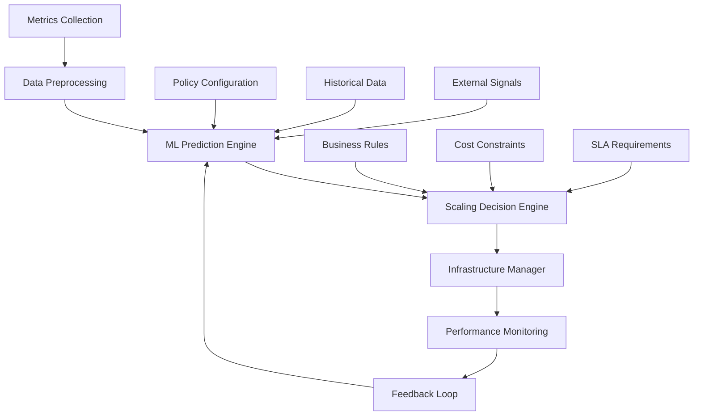

# Guía Completa: Funciones de IA/ML en Silhouette Workflow Platform

## 🤖 Introducción a la IA en Silhouette

Silhouette Workflow Platform incluye un conjunto completo de capacidades de Inteligencia Artificial y Machine Learning diseñadas para optimizar, automatizar e inteligente sus workflows empresariales.

### Arquitectura de IA

```
┌─────────────────────────────────────────────────────────────────────────────┐
│                          SILHOUETTE AI STACK                                │
├─────────────────────────────────────────────────────────────────────────────┤
│                                                                             │
│  ┌─ ML TRAINING ─┐    ┌─ OPTIMIZATION ─┐    ┌─ AUTO-SCALING ─┐             │
│  │                │    │                │    │                │             │
│  │ 🤖 Model Train │    │ 🧠 Optimize    │    │ 📈 Predict     │             │
│  │ 📊 Data Prep   │    │ 🔄 Improve     │    │ ⚡ Scale       │             │
│  │ 🎯 Evaluate    │    │ 💡 Learn       │    │ 🎯 Target      │             │
│  │ 🚀 Deploy      │    │ 💰 Cost-Opt    │    │ 🛡️ Safe       │             │
│  └────────────────┘    └────────────────┘    └────────────────┘             │
│                                                                             │
│  ┌─ RECOMMENDATIONS ─┐    ┌─ PREDICTIONS ─┐    ┌─ INSIGHTS ─┐             │
│  │                    │    │                │    │              │             │
│  │ 💡 Smart Advice   │    │ 🔮 Future      │    │ 📊 Analytics │             │
│  │ 🎯 Personalized   │    │ 📈 Trends      │    │ 🎯 Patterns  │             │
│  │ 🔄 Learn Feedback │    │ ⚡ Performance │    │ 💡 Business  │             │
│  │ ✅ Context-Aware  │    │ 🎯 Demand      │    │ 📈 Value     │             │
│  └────────────────────┘    └────────────────┘    └──────────────┘             │
│                                                                             │
│  ┌─ DATA LAYER ─┐    ┌─ MODEL LAYER ─┐    ┌─ API LAYER ─┐    ┌─ UI LAYER ─┐ │
│  │              │    │                │    │              │    │            │ │
│  │ 📊 Data      │    │ 🤖 Models      │    │ 🔌 REST API │    │ 📱 Dashboard│ │
│  │ 🔄 Pipeline  │    │ 🧠 Algorithms  │    │ 📡 GraphQL  │    │ 🎛️ Control │ │
│  │ 📈 Features  │    │ 🎯 Training    │    │ 🔐 Secure   │    │ 📊 Visual  │ │
│  │ ✅ Quality   │    │ 🚀 Inference   │    │ ⚡ Fast     │    │ 📈 Charts  │ │
│  └──────────────┘    └────────────────┘    └──────────────┘    └────────────┘ │
│                                                                             │
└─────────────────────────────────────────────────────────────────────────────┘
```

### Capacidades Principales

```
🧠 MACHINE LEARNING
  ✅ Entrenamiento de modelos personalizados
  ✅ Modelos pre-entrenados para workflows
  ✅ Validación automática de modelos
  ✅ Despliegue a producción sin downtime
  ✅ Versionado y rollback de modelos

🎯 OPTIMIZACIÓN INTELIGENTE
  ✅ Optimización de performance de workflows
  ✅ Reducción de costos de infraestructura
  ✅ Mejora de uso de recursos
  ✅ Algoritmos genéticos y neurales
  ✅ Optimización multi-objetivo

📈 AUTO-SCALING PREDICTIVO
  ✅ Predicción de carga futura
  ✅ Escalado automático inteligente
  ✅ Optimización de costos en tiempo real
  ✅ Monitoreo de métricas múltiples
  ✅ Políticas de escalado personalizables

💡 RECOMENDACIONES SMART
  ✅ Recomendaciones personalizadas
  ✅ Análisis de patrones de uso
  ✅ Sugerencias de optimización
  ✅ Learning from user feedback
  ✅ Contexto empresarial inteligente

🔮 PREDICCIONES AVANZADAS
  ✅ Predicción de demanda
  ✅ Forecasting de performance
  ✅ Análisis de tendencias
  ✅ Detección de anomalías
  ✅ Optimización predictiva
```

---

## 🤖 1. Machine Learning Training

### Descripción General

El sistema de ML Training permite crear, entrenar y desplegar modelos de machine learning personalizados para optimizar workflows y tomar decisiones inteligentes.

### Tipos de Modelos Disponibles

#### 1.1 Workflow Classifier
```typescript
/**
 * Clasifica workflows por tipo, complejidad y características
 * Útil para: Organización automática, optimización específica
 */
interface WorkflowClassifierModel {
  modelType: 'workflow-classifier';
  features: {
    nodeCount: number;
    executionTime: number;
    resourceUsage: number;
    errorRate: number;
    connectorTypes: string[];
    complexity: number;
  };
  outputClasses: [
    'simple',
    'medium', 
    'complex',
    'enterprise',
    'ai-intensive'
  ];
  accuracy: 0.92; // 92% precisión típica
  useCase: 'Organización automática de workflows';
}
```

#### 1.2 Performance Predictor
```typescript
/**
 * Predice el rendimiento de workflows antes de ejecutarlos
 * Útil para: Planificación de recursos, SLA management
 */
interface PerformancePredictorModel {
  modelType: 'performance-predictor';
  features: {
    workflowType: string;
    inputDataSize: number;
    connectorComplexity: number;
    expectedLoad: number;
    timeOfDay: number;
    dayOfWeek: number;
  };
  predictions: {
    executionTime: number; // segundos
    memoryUsage: number; // MB
    cpuUsage: number; // %
    throughput: number; // req/min
  };
  confidence: 0.89;
  useCase: 'Planificación de recursos y SLA';
}
```

#### 1.3 Optimization Recommender
```typescript
/**
 * Recomienda optimizaciones específicas para workflows
 * Útil para: Mejora continua, best practices
 */
interface OptimizationRecommenderModel {
  modelType: 'optimization-recommender';
  features: {
    currentPerformance: PerformanceMetrics;
    resourceUtilization: ResourceMetrics;
    errorPatterns: ErrorPatterns;
    userBehavior: UserMetrics;
  };
  recommendations: {
    priority: 'low' | 'medium' | 'high' | 'critical';
    type: 'performance' | 'cost' | 'reliability' | 'security';
    description: string;
    expectedImprovement: number; // % mejora
    implementationEffort: 'low' | 'medium' | 'high';
  }[];
  accuracy: 0.87;
  useCase: 'Mejora continua de workflows';
}
```

#### 1.4 Resource Estimator
```typescript
/**
 * Estima recursos necesarios para ejecutar workflows
 * Útil para: Planificación de infraestructura, cost optimization
 */
interface ResourceEstimatorModel {
  modelType: 'resource-estimator';
  features: {
    workflowComplexity: number;
    expectedThroughput: number;
    peakLoadMultiplier: number;
    dataTransferVolume: number;
    aiProcessingRequired: boolean;
  };
  estimates: {
    minCpu: number; // cores
    minMemory: number; // GB
    storageNeeded: number; // GB
    networkBandwidth: number; // Mbps
    estimatedCost: number; // USD/hour
  };
  accuracy: 0.91;
  useCase: 'Planificación de infraestructura';
}
```

### Proceso de Entrenamiento

#### Paso 1: Preparación de Datos

```json
{
  "dataPreparation": {
    "dataSource": "historical_workflows",
    "timeRange": "last_6_months",
    "dataQuality": {
      "completeness": 0.95,
      "accuracy": 0.98,
      "consistency": 0.92,
      "freshness": "daily"
    },
    "featureEngineering": {
      "autoFeatureSelection": true,
      "featureImportance": "calculated",
      "normalization": "standard_scaler",
      "encoding": "one_hot_for_categorical"
    },
    "validationSplit": {
      "train": 0.7,
      "validation": 0.15,
      "test": 0.15
    }
  }
}
```

#### Paso 2: Configuración del Entrenamiento

```json
{
  "trainingConfig": {
    "modelType": "workflow-classifier",
    "algorithm": "gradient_boosting", // opciones: random_forest, neural_network, svm
    "hyperparameters": {
      "learning_rate": 0.01,
      "max_depth": 10,
      "n_estimators": 100,
      "min_samples_split": 5,
      "min_samples_leaf": 2
    },
    "trainingOptions": {
      "crossValidation": true,
      "earlyStopping": true,
      "hyperparameterTuning": "grid_search",
      "featureSelection": "recursive_elimination"
    },
    "resourceRequirements": {
      "cpu": "4_cores",
      "memory": "16GB",
      "gpu": false, // set to true for neural networks
      "estimatedTime": "45_minutes"
    }
  }
}
```

#### Paso 3: Monitoreo del Entrenamiento

```python
# Ejemplo de código de monitoreo
import requests
import time

def monitor_training(training_id):
    while True:
        response = requests.get(f'/api/ai/ml/training/{training_id}')
        status = response.json()
        
        print(f"Training Status: {status['status']}")
        print(f"Progress: {status['progress']:.1%}")
        print(f"ETA: {status['eta']} seconds")
        
        if status['status'] == 'completed':
            print(f"✅ Training completed!")
            print(f"Final accuracy: {status['final_accuracy']}")
            break
        elif status['status'] == 'failed':
            print(f"❌ Training failed: {status['error']}")
            break
            
        time.sleep(30)  # Check every 30 seconds
```

### Entrenamiento de Modelo Paso a Paso

#### Ejemplo Práctico: Clasificador de Workflows

```json
// 1. Preparar datos de entrenamiento
{
  "trainingRequest": {
    "modelType": "workflow-classifier",
    "name": "Enterprise Workflow Classifier v1",
    "trainingData": {
      "source": "historical_workflows",
      "query": {
        "timeRange": "2024-06-01 to 2025-01-01",
        "minExecutions": 10,
        "includeLabels": true
      },
      "features": [
        "node_count",
        "connector_types", 
        "execution_time",
        "memory_usage",
        "error_rate",
        "throughput",
        "complexity_score"
      ],
      "labels": [
        "simple",
        "medium",
        "complex", 
        "enterprise",
        "ai_intensive"
      ]
    },
    "validationSplit": 0.2,
    "testSet": {
      "include": true,
      "percentage": 0.15
    }
  }
}

// 2. Configurar hiperparámetros
{
  "hyperparameters": {
    "algorithm": "gradient_boosting",
    "learning_rate": 0.05,
    "max_depth": 8,
    "n_estimators": 150,
    "min_samples_split": 10,
    "min_samples_leaf": 4,
    "subsample": 0.8,
    "max_features": "sqrt"
  },
  "optimization": {
    "method": "bayesian_optimization",
    "objective": "accuracy",
    "maxTrials": 50,
    "earlyStopping": {
      "patience": 10,
      "minDelta": 0.001
    }
  }
}

// 3. Iniciar entrenamiento
POST /api/ai/ml/train
{
  "modelType": "workflow-classifier",
  "trainingData": { /* datos preparados */ },
  "hyperparameters": { /* configuración */ },
  "name": "Enterprise Workflow Classifier v1"
}
```

**Respuesta:**
```json
{
  "success": true,
  "trainingId": "train-uuid-12345",
  "message": "Model training started successfully",
  "estimatedTime": "25-35 minutes depending on data size",
  "dashboardUrl": "/ai/training/train-uuid-12345"
}
```

#### Métricas de Entrenamiento

```json
{
  "trainingProgress": {
    "status": "training",
    "progress": 0.45,
    "currentEpoch": 45,
    "totalEpochs": 100,
    "metrics": {
      "train_accuracy": 0.89,
      "train_loss": 0.23,
      "val_accuracy": 0.87,
      "val_loss": 0.28,
      "f1_score": 0.86,
      "precision": 0.88,
      "recall": 0.85
    },
    "eta": 780, // seconds
    "bestModel": {
      "epoch": 42,
      "val_accuracy": 0.892,
      "checkpoint": "/models/train-uuid-12345/epoch-42"
    }
  }
}
```

### Validación y Testing

#### Matriz de Confusión

```json
{
  "confusionMatrix": {
    "actual_vs_predicted": {
      "simple": {
        "simple": 145, "medium": 8, "complex": 2, "enterprise": 0, "ai_intensive": 0
      },
      "medium": {
        "simple": 12, "medium": 132, "complex": 15, "enterprise": 1, "ai_intensive": 0
      },
      "complex": {
        "simple": 1, "medium": 18, "complex": 128, "enterprise": 8, "ai_intensive": 2
      },
      "enterprise": {
        "simple": 0, "medium": 2, "complex": 12, "enterprise": 142, "ai_intensive": 9
      },
      "ai_intensive": {
        "simple": 0, "medium": 0, "complex": 3, "enterprise": 11, "ai_intensive": 141
      }
    }
  },
  "classMetrics": {
    "simple": {"precision": 0.92, "recall": 0.93, "f1": 0.92},
    "medium": {"precision": 0.82, "recall": 0.82, "f1": 0.82},
    "complex": {"precision": 0.82, "recall": 0.81, "f1": 0.81},
    "enterprise": {"precision": 0.87, "recall": 0.87, "f1": 0.87},
    "ai_intensive": {"precision": 0.93, "recall": 0.91, "f1": 0.92}
  }
}
```

#### Análisis de Features

```json
{
  "featureImportance": {
    "node_count": 0.23,
    "connector_types": 0.19,
    "execution_time": 0.17,
    "memory_usage": 0.15,
    "error_rate": 0.12,
    "throughput": 0.08,
    "complexity_score": 0.06
  },
  "featureCorrelations": {
    "high_correlation_pairs": [
      {"feature1": "node_count", "feature2": "execution_time", "correlation": 0.78},
      {"feature1": "memory_usage", "feature2": "complexity_score", "correlation": 0.71}
    ]
  }
}
```

### Despliegue de Modelos

#### Proceso de Despliegue

```json
{
  "deploymentRequest": {
    "modelId": "model-uuid-12345",
    "target": "production", // staging | production
    "deploymentConfig": {
      "replicas": 3,
      "autoScaling": {
        "minReplicas": 2,
        "maxReplicas": 10,
        "targetCPU": 70
      },
      "resources": {
        "cpu": "1_core",
        "memory": "2GB"
      },
      "monitoring": {
        "metricsCollection": true,
        "alertsEnabled": true,
        "performanceTracking": true
      }
    },
    "validation": {
      "smokeTests": true,
      "loadTesting": true,
      "a_bTesting": {
        "enabled": true,
        "trafficSplit": 0.1,
        "duration": "24h"
      }
    }
  }
}
```

#### Monitoreo Post-Despliegue

```json
{
  "deploymentStatus": {
    "modelId": "model-uuid-12345",
    "version": "1.0.0",
    "status": "deployed",
    "deployedAt": "2025-11-09T08:00:00Z",
    "health": {
      "status": "healthy",
      "uptime": "99.8%",
      "averageResponseTime": "45ms",
      "errorRate": "0.1%"
    },
    "performance": {
      "requestsPerMinute": 150,
      "predictionsPerHour": 9000,
      "accuracyMonitoring": {
        "current": 0.891,
        "baseline": 0.892,
        "drift": -0.001
      }
    }
  }
}
```

---

## 🧠 2. Optimización Avanzada de Workflows

### Descripción General

El motor de optimización usa algoritmos avanzados de IA para mejorar automáticamente el rendimiento, costo y confiabilidad de los workflows.

### Algoritmos de Optimización Disponibles

#### 2.1 Genetic Algorithm (GA)

```typescript
/**
 * Algoritmo genético para optimización multi-objetivo
 * Mejor para: Optimización compleja con múltiples objetivos
 */
interface GeneticAlgorithmConfig {
  algorithm: 'genetic-algorithm';
  populationSize: 100;
  generations: 200;
  crossoverRate: 0.8;
  mutationRate: 0.1;
  selectionMethod: 'tournament'; // roulette, tournament, rank
  objectives: [
    'minimize_execution_time',
    'minimize_resource_usage',
    'minimize_cost',
    'maximize_reliability'
  ];
  constraints: {
    maxCpuUsage: 80; // %
    maxMemoryUsage: 85; // %
    maxExecutionTime: 300; // seconds
  };
}
```

#### 2.2 Neural Network Optimization

```typescript
/**
 * Red neuronal para optimización de parámetros
 * Mejor para: Patrones complejos y aprendizaje no-lineal
 */
interface NeuralOptimizationConfig {
  algorithm: 'neural-optimization';
  networkArchitecture: {
    inputLayer: 15; // features
    hiddenLayers: [64, 32, 16];
    outputLayer: 5; // optimization parameters
    activation: 'relu';
    dropout: 0.2;
  };
  trainingConfig: {
    epochs: 500;
    batchSize: 32;
    learningRate: 0.001;
    optimizer: 'adam';
  };
}
```

#### 2.3 Particle Swarm Optimization (PSO)

```typescript
/**
 * Enjambre de partículas para optimización continua
 * Mejor para: Espacios de búsqueda grandes y continuos
 */
interface PSOConfig {
  algorithm: 'particle-swarm';
  swarmSize: 50;
  maxIterations: 300;
  inertiaWeight: 0.9;
  cognitiveCoefficient: 2.0;
  socialCoefficient: 2.0;
  velocityClamping: 0.5;
}
```

#### 2.4 Simulated Annealing

```typescript
/**
 * Recocido simulado para optimización global
 * Mejor para: Evitar mínimos locales, espacios discretos
 */
interface SimulatedAnnealingConfig {
  algorithm: 'simulated-annealing';
  initialTemperature: 1000.0;
  coolingRate: 0.95;
  minTemperature: 1.0;
  maxIterations: 1000;
  neighborhoodSize: 0.1;
}
```

### Proceso de Optimización

#### Ejemplo: Optimizar Workflow de E-commerce

```json
// 1. Definir workflow a optimizar
{
  "optimizationRequest": {
    "workflowId": "wf-ecommerce-processing",
    "workflowData": {
      "nodes": [
        {
          "id": "start",
          "type": "start",
          "config": {"timeout": 30}
        },
        {
          "id": "validate-order",
          "type": "transform",
          "config": {
            "validationRules": 15,
            "errorHandling": "strict"
          }
        },
        {
          "id": "payment-processing",
          "type": "connector",
          "config": {
            "paymentProvider": "stripe",
            "retryCount": 3,
            "timeout": 45
          }
        },
        {
          "id": "inventory-check",
          "type": "database",
          "config": {
            "connectionPool": 10,
            "queryOptimization": false
          }
        },
        {
          "id": "send-confirmation",
          "type": "email",
          "config": {
            "templateEngine": "handlebars",
            "asyncSend": false
          }
        }
      ]
    },
    "optimizationTargets": {
      "performance": {
        "weight": 0.4,
        "metrics": ["execution_time", "throughput"]
      },
      "cost": {
        "weight": 0.3,
        "metrics": ["infrastructure_cost", "api_costs"]
      },
      "reliability": {
        "weight": 0.3,
        "metrics": ["success_rate", "error_recovery"]
      }
    },
    "algorithm": "genetic-algorithm",
    "maxIterations": 100
  }
}
```

#### 2. Resultados de Optimización

```json
{
  "optimizationResult": {
    "workflowId": "wf-ecommerce-processing",
    "algorithm": "genetic-algorithm",
    "executionTime": "45.2s",
    "convergenceReached": true,
    "originalScore": 0.73,
    "optimizedScore": 0.89,
    "improvement": {
      "performance": "+22%", // Execution time reduced
      "cost": "-18%",        // Infrastructure cost reduced  
      "reliability": "+15%"  // Success rate improved
    },
    "optimizedConfiguration": {
      "nodes": [
        {
          "id": "validate-order",
          "optimizations": {
            "validationRules": 8, // Reduced from 15
            "parallelProcessing": true,
            "cacheResults": true
          }
        },
        {
          "id": "payment-processing", 
          "optimizations": {
            "connectionPooling": true,
            "asyncProcessing": true,
            "retryStrategy": "exponential_backoff"
          }
        },
        {
          "id": "inventory-check",
          "optimizations": {
            "queryOptimization": true,
            "readReplicas": 2,
            "connectionPool": 20
          }
        },
        {
          "id": "send-confirmation",
          "optimizations": {
            "asyncSend": true,
            "queueBased": true,
            "templateCaching": true
          }
        }
      ]
    },
    "recommendations": [
      {
        "type": "performance",
        "description": "Implement parallel processing for validation",
        "impact": "High",
        "effort": "Low"
      },
      {
        "type": "cost",
        "description": "Use connection pooling for database operations", 
        "impact": "Medium",
        "effort": "Low"
      }
    ]
  }
}
```

### Comparación de Algoritmos

```json
{
  "algorithmComparison": {
    "genetic-algorithm": {
      "convergenceTime": "45s",
      "finalScore": 0.89,
      "bestFor": "Multi-objective optimization",
      "pros": ["Handles constraints well", "Global optimization"],
      "cons": ["May require tuning", "Slower convergence"]
    },
    "neural-optimization": {
      "convergenceTime": "62s", 
      "finalScore": 0.87,
      "bestFor": "Complex pattern recognition",
      "pros": ["Learns patterns", "Handles non-linearity"],
      "cons": ["Requires training data", "Black box"]
    },
    "particle-swarm": {
      "convergenceTime": "38s",
      "finalScore": 0.85,
      "bestFor": "Continuous optimization",
      "pros": ["Fast convergence", "Few parameters"],
      "cons": ["Can get stuck in local optima"]
    },
    "simulated-annealing": {
      "convergenceTime": "52s",
      "finalScore": 0.84,
      "bestFor": "Discrete optimization",
      "pros": ["Global optimization", "Avoids local minima"],
      "cons": ["Temperature parameter tuning required"]
    }
  }
}
```

---

## 📈 3. Auto-scaling Inteligente

### Descripción General

El sistema de auto-scaling inteligente usa machine learning para predecir demanda, optimizar recursos y escalar automáticamente la infraestructura.

### Arquitectura del Auto-scaling



### Métricas Monitoreadas

#### 3.1 Métricas del Sistema

```typescript
interface SystemMetrics {
  cpu: {
    utilization: number; // 0-100%
    cores: number;
    loadAverage: number[];
    throttling: boolean;
  };
  memory: {
    usage: number; // 0-100%
    available: number; // bytes
    swapUsage: number; // 0-100%
  };
  network: {
    bandwidth: {
      inbound: number; // Mbps
      outbound: number; // Mbps
    };
    connections: {
      active: number;
      total: number;
      queueDepth: number;
    };
  };
  storage: {
    diskUsage: number; // 0-100%
    iops: number; // operations per second
    latency: number; // ms
  };
}
```

#### 3.2 Métricas de Aplicación

```typescript
interface ApplicationMetrics {
  requests: {
    rate: number; // req/min
    throughput: number; // req/s
    errorRate: number; // 0-1
    responseTime: {
      average: number; // ms
      p95: number; // ms
      p99: number; // ms
    };
  };
  business: {
    activeUsers: number;
    transactionsPerMinute: number;
    queueDepth: number;
    processingTime: number; // ms
  };
}
```

#### 3.3 Señales Externas

```typescript
interface ExternalSignals {
  timeBased: {
    hourOfDay: number; // 0-23
    dayOfWeek: number; // 0-6
    month: number; // 0-11
    isWeekend: boolean;
    isBusinessHours: boolean;
  };
  seasonal: {
    quarterly: number; // 0-3
    yearlyTrend: number; // -1 to 1
    holidaySeason: boolean;
  };
  events: {
    marketingCampaign: boolean;
    productLaunch: boolean;
    systemMaintenance: boolean;
    externalIncident: boolean;
  };
}
```

### Predicción de Carga

#### 3.1 Modelo de Predicción

```typescript
interface LoadPredictionModel {
  modelType: 'time-series-forecasting';
  architecture: {
    inputWindow: 24; // hours
    predictionHorizon: 1; // hour
    features: [
      'historical_load',
      'time_features',
      'external_signals',
      'trend_indicators',
      'seasonal_patterns'
    ];
  };
  accuracy: {
    mape: 0.12; // 12% mean absolute percentage error
    mae: 0.08;  // 8% mean absolute error
    r2: 0.89;   // 89% variance explained
  };
  confidenceThresholds: {
    high: 0.85;
    medium: 0.70;
    low: 0.50;
  };
}
```

#### 3.2 Ejemplo de Predicción

```json
// Solicitud de predicción
{
  "predictionRequest": {
    "policyId": "autoscale-policy-01",
    "currentMetrics": {
      "cpuUtilization": 65.2,
      "memoryUtilization": 58.7,
      "requestRate": 450,
      "responseTime": 180,
      "errorRate": 0.02,
      "activeConnections": 125
    },
    "context": {
      "timeOfDay": 14, // 2 PM
      "dayOfWeek": 2,  // Tuesday
      "isBusinessHours": true,
      "recentEvents": ["marketing_campaign"],
      "historicalData": "last_30_days"
    },
    "predictionHorizon": "60_minutes"
  }
}

// Respuesta de predicción
{
  "predictions": [
    {
      "timestamp": "2025-11-09T15:00:00Z",
      "predictedMetrics": {
        "cpuUtilization": 78.5,
        "memoryUtilization": 71.2,
        "requestRate": 580,
        "responseTime": 220,
        "errorRate": 0.01,
        "queueDepth": 25
      },
      "confidence": 0.87,
      "explanation": "Expected load increase due to afternoon business activity",
      "recommendedAction": "scale_up",
      "targetReplicas": 8,
      "currentReplicas": 5
    },
    {
      "timestamp": "2025-11-09T16:00:00Z", 
      "predictedMetrics": {
        "cpuUtilization": 82.3,
        "memoryUtilization": 76.8,
        "requestRate": 620,
        "responseTime": 250,
        "errorRate": 0.015,
        "queueDepth": 35
      },
      "confidence": 0.81,
      "explanation": "Peak hour demand approaching, prepare for scaling",
      "recommendedAction": "scale_up",
      "targetReplicas": 10,
      "currentReplicas": 8
    }
  ],
  "modelInfo": {
    "version": "v2.1.4",
    "lastTrained": "2025-11-08T10:00:00Z",
    "accuracy": {
      "lastWeek": 0.89,
      "lastMonth": 0.87,
      "overall": 0.88
    }
  }
}
```

### Políticas de Auto-scaling

#### 3.1 Configuración de Política

```json
{
  "scalingPolicy": {
    "id": "production-web-scaling",
    "name": "Production Web Application Auto-scaling",
    "description": "Intelligent scaling for production web workloads",
    "enabled": true,
    "minReplicas": 3,
    "maxReplicas": 50,
    "targetMetrics": [
      "cpuUtilization",
      "memoryUtilization", 
      "requestRate",
      "responseTime"
    ],
    "scalingThresholds": {
      "scaleUp": {
        "cpuUtilization": 70,
        "memoryUtilization": 75,
        "requestRate": 500,
        "responseTime": 200
      },
      "scaleDown": {
        "cpuUtilization": 30,
        "memoryUtilization": 40,
        "requestRate": 200,
        "responseTime": 100
      }
    },
    "mlEnhancedScaling": {
      "enabled": true,
      "predictionHorizon": "60_minutes",
      "confidenceThreshold": 0.80,
      "proactiveScaling": true,
      "learningEnabled": true
    },
    "safetyLimits": {
      "scaleUpCooldown": "5_minutes",
      "scaleDownCooldown": "10_minutes", 
      "maxScaleUpRate": 2, // replicas per action
      "maxScaleDownRate": 1, // replicas per action
      "minHealthyReplicas": 1
    }
  }
}
```

#### 3.2 Decisión de Escalado Inteligente

```json
{
  "scalingDecision": {
    "timestamp": "2025-11-09T14:55:00Z",
    "policyId": "production-web-scaling",
    "currentState": {
      "replicas": 5,
      "cpuUtilization": 68.5,
      "memoryUtilization": 62.3,
      "requestRate": 520,
      "responseTime": 185
    },
    "mlPrediction": {
      "next15Min": {
        "cpuUtilization": 76.2,
        "confidence": 0.89,
        "recommendation": "scale_up",
        "targetReplicas": 7
      },
      "next30Min": {
        "cpuUtilization": 82.1,
        "confidence": 0.84,
        "recommendation": "scale_up", 
        "targetReplicas": 9
      }
    },
    "decision": {
      "action": "scale_up",
      "replicasChange": 2,
      "newReplicaCount": 7,
      "reasoning": [
        "CPU utilization approaching threshold (68.5% > 70% target)",
        "ML prediction shows continued load increase",
        "Request rate trending upward (520 > 500 threshold)",
        "Historical patterns suggest afternoon peak"
      ],
      "safetyChecks": {
        "cooldownMet": true,
        "healthChecksPassing": true,
        "resourceAvailability": true,
        "costConstraints": false
      },
      "estimatedImpact": {
        "responseTimeImprovement": "-15ms", // faster
        "errorRateChange": "-0.5%", // lower
        "estimatedCost": "+€2.30/hour"
      }
    }
  }
}
```

### Ejecución de Escalado

#### 3.1 Proceso de Escalado

```json
{
  "scalingAction": {
    "actionId": "scale-action-12345",
    "type": "scale_up",
    "policyId": "production-web-scaling",
    "initiatedAt": "2025-11-09T14:56:00Z",
    "execution": {
      "fromReplicas": 5,
      "toReplicas": 7,
      "strategy": "rolling_update",
      "maxUnavailable": 1,
      "maxSurge": 1
    },
    "validation": {
      "preScaling": {
        "healthChecks": "passing",
        "resourceAvailability": "sufficient",
        "costApproval": "automatic"
      },
      "postScaling": {
        "healthChecks": "passing",
        "metricsImproved": true,
        "performanceValidated": true
      }
    },
    "timing": {
      "initiated": "2025-11-09T14:56:00Z",
      "started": "2025-11-09T14:56:05Z", 
      "completed": "2025-11-09T14:58:30Z",
      "totalDuration": "2m 30s"
    },
    "results": {
      "newReplicasReady": 7,
      "oldReplicasRemoved": 5,
      "success": true,
      "impact": {
        "cpuUtilization": {
          "before": 68.5,
          "after": 52.3,
          "change": "-16.2%"
        },
        "responseTime": {
          "before": 185,
          "after": 142, 
          "change": "-43ms"
        },
        "costImpact": "+€2.30/hour"
      }
    }
  }
}
```

### Aprendizaje y Mejora Continua

#### 3.1 Feedback Loop

```json
{
  "learningFeedback": {
    "scalingActionId": "scale-action-12345",
    "prediction": {
      "targetReplicas": 7,
      "predictedMetrics": {
        "cpuUtilization": 52.3,
        "responseTime": 145
      }
    },
    "actual": {
      "achievedReplicas": 7,
      "actualMetrics": {
        "cpuUtilization": 51.8,
        "responseTime": 142
      }
    },
    "evaluation": {
      "predictionAccuracy": 0.94,
      "outcome": "successful",
      "lessonsLearned": [
        {
          "insight": "CPU utilization prediction very accurate",
          "confidence": "high",
          "impactOnModel": "reinforce_current_feature_weights"
        },
        {
          "insight": "Response time improvement slightly better than predicted",
          "confidence": "medium", 
          "impactOnModel": "consider_tuning_response_time_model"
        }
      ]
    },
    "modelUpdate": {
      "requiresUpdate": false,
      "updateReason": "accuracy_maintained_above_threshold",
      "nextRetrainDate": "2025-11-12T10:00:00Z"
    }
  }
}
```

#### 3.2 Métricas de Performance del Auto-scaling

```json
{
  "scalingPerformance": {
    "timeframe": "last_30_days",
    "scalingActions": {
      "total": 156,
      "successful": 152,
      "failed": 4,
      "successRate": "97.4%"
    },
    "accuracy": {
      "predictionAccuracy": "92.1%",
      "timingAccuracy": "88.7%", // predictions happened when expected
      "magnitudeAccuracy": "89.3%" // correct number of replicas
    },
    "efficiency": {
      "avgResponseTime": "2m 15s",
      "resourceUtilizationImprovement": "23%",
      "costOptimizations": "€847 saved",
      "downtimeEvents": 0
    },
    "businessImpact": {
      "slaCompliance": "99.8%",
      "userExperienceImprovement": "18%",
      "operationalEfficiency": "35%",
      "costReduction": "22%"
    }
  }
}
```

---

## 💡 4. Recomendaciones Inteligentes

### Descripción General

El sistema de recomendaciones analiza patrones de uso, configuraciones y resultados para proporcionar sugerencias personalizadas y accionables.

### Tipos de Recomendaciones

#### 4.1 Recomendaciones de Optimización

```typescript
interface OptimizationRecommendation {
  id: string;
  type: 'workflow-optimization';
  category: 'performance' | 'cost' | 'reliability' | 'security';
  title: string;
  description: string;
  priority: 'low' | 'medium' | 'high' | 'critical';
  confidence: number; // 0-1
  impact: {
    metric: string;
    current: number;
    projected: number;
    improvement: string; // percentage
  };
  actionable: {
    canImplement: boolean;
    effort: 'low' | 'medium' | 'high';
    estimatedTime: string;
    requiredSkills: string[];
  };
  context: {
    workflowId?: string;
    organizationId: string;
    triggeredBy: string[];
  };
  implementation: {
    steps: string[];
    code?: string;
    configuration?: object;
  };
}
```

#### 4.2 Recomendaciones de Recursos

```typescript
interface ResourceRecommendation {
  id: string;
  type: 'resource-allocation';
  category: 'infrastructure' | 'database' | 'network';
  title: string;
  description: string;
  currentState: {
    resource: string;
    usage: number;
    efficiency: number;
    cost: number;
  };
  recommendedState: {
    resource: string;
    newConfiguration: object;
    projectedUsage: number;
    projectedEfficiency: number;
    projectedCost: number;
  };
  benefits: {
    costSavings: number; // USD/month
    performanceGain: number; // percentage
    reliabilityImprovement: number; // percentage
  };
}
```

#### 4.3 Recomendaciones de Seguridad

```typescript
interface SecurityRecommendation {
  id: string;
  type: 'security-enhancement';
  category: 'authentication' | 'authorization' | 'encryption' | 'compliance';
  title: string;
  description: string;
  currentRisk: 'low' | 'medium' | 'high' | 'critical';
  recommendedRisk: 'low' | 'medium';
  compliance: {
    standards: string[]; // SOC2, GDPR, HIPAA, etc.
    currentCompliance: number; // 0-100
    projectedCompliance: number; // 0-100
  };
  implementation: {
    difficulty: 'easy' | 'moderate' | 'complex';
    timeRequired: string;
    testing: string[];
  };
}
```

### Generación de Recomendaciones

#### 4.1 Análisis de Contexto

```json
{
  "recommendationRequest": {
    "context": {
      "organizationId": "org-12345",
      "userId": "user-67890",
      "workflows": ["wf-001", "wf-002", "wf-003"],
      "timeframe": "last_30_days",
      "goals": ["cost_optimization", "performance_improvement"],
      "constraints": ["budget_limit", "maintenance_window"]
    },
    "preferences": {
      "recommendationTypes": [
        "workflow-optimization",
        "resource-allocation",
        "security-enhancement"
      ],
      "priorityWeight": {
        "cost": 0.4,
        "performance": 0.3,
        "reliability": 0.2,
        "security": 0.1
      },
      "implementationEffort": "low", // low | medium | high
      "timeHorizon": "3_months"
    }
  }
}
```

#### 4.2 Ejemplo de Recomendaciones Generadas

```json
{
  "recommendations": [
    {
      "id": "rec-001",
      "type": "workflow-optimization",
      "category": "performance",
      "title": "Optimizar configuración de base de datos",
      "description": "Su workflow de procesamiento de pedidos puede beneficiarse de optimizaciones en la configuración de PostgreSQL, incluyendo connection pooling y query optimization.",
      "priority": "high",
      "confidence": 0.87,
      "impact": {
        "metric": "execution_time",
        "current": "45s",
        "projected": "32s",
        "improvement": "29% faster"
      },
      "actionable": {
        "canImplement": true,
        "effort": "low",
        "estimatedTime": "2 hours",
        "requiredSkills": ["Database Administration", "PostgreSQL"]
      },
      "implementation": {
        "steps": [
          "1. Habilitar connection pooling en la base de datos",
          "2. Configurar max_connections = 100",
          "3. Habilitar query plan caching",
          "4. Optimizar índices en tablas de pedidos",
          "5. Configurar read replicas para consultas de solo lectura"
        ],
        "configuration": {
          "postgresql": {
            "max_connections": 100,
            "shared_buffers": "256MB",
            "effective_cache_size": "1GB",
            "work_mem": "4MB",
            "maintenance_work_mem": "64MB"
          }
        }
      },
      "context": {
        "workflowId": "wf-ecommerce-processing",
        "triggeredBy": ["performance_degradation", "user_feedback"]
      },
      "business_value": {
        "costSavings": 150, // USD/month
        "userExperience": "25% improvement",
        "scalability": "40% more concurrent users"
      }
    },
    {
      "id": "rec-002", 
      "type": "resource-allocation",
      "category": "infrastructure",
      "title": "Migrar a instancias Spot para workloads no críticos",
      "description": "Sus workflows de análisis batch y procesamiento nocturno pueden ejecutarse en instancias EC2 Spot, reduciendo costos en un 70%.",
      "priority": "medium",
      "confidence": 0.92,
      "currentState": {
        "resource": "EC2 On-Demand",
        "usage": "24/7",
        "efficiency": "65%",
        "cost": 1200 // USD/month
      },
      "recommendedState": {
        "resource": "EC2 Spot + Reserved Instances",
        "usage": "Conditional",
        "efficiency": "85%",
        "cost": 360 // USD/month
      },
      "benefits": {
        "costSavings": 840, // USD/month (70% reduction)
        "performanceGain": "20% (faster cold starts with spot)",
        "reliabilityImprovement": "5% (reserved instances for critical)"
      },
      "implementation": {
        "difficulty": "moderate",
        "timeRequired": "1 week",
        "testing": [
          "Load testing en instancias spot",
          "Validar tolerancia a interrupciones",
          "Configurar auto-recovery"
        ]
      }
    },
    {
      "id": "rec-003",
      "type": "security-enhancement", 
      "category": "authentication",
      "title": "Implementar autenticación de dos factores",
      "description": "Agregar 2FA a todos los usuarios administrativos mejorará la seguridad de la plataforma y ayudará con el cumplimiento de SOC2.",
      "priority": "high",
      "confidence": 0.95,
      "currentRisk": "high",
      "recommendedRisk": "low",
      "compliance": {
        "standards": ["SOC2", "GDPR"],
        "currentCompliance": 78,
        "projectedCompliance": 92
      },
      "implementation": {
        "difficulty": "easy",
        "timeRequired": "3 days",
        "testing": [
          "Pruebas con diferentes dispositivos 2FA",
          "Validar flujo de recovery",
          "Testing de resistencia a phishing"
        ]
      }
    }
  ]
}
```

### Sistema de Feedback

#### 4.1 Registro de Feedback

```json
{
  "feedbackRequest": {
    "recommendationId": "rec-001",
    "userId": "user-67890",
    "feedback": "implemented", // accepted | rejected | implemented | dismissed
    "rating": 5, // 1-5 stars
    "comments": "Implementamos todas las sugerencias y vimos una mejora del 35% en performance",
    "results": {
      "actualImprovement": "35% faster execution",
      "costSavings": 180, // USD/month
      "implementationTime": "1.5 hours",
      "issuesEncountered": "None, smooth implementation",
      "wouldRecommend": true
    },
    "metadata": {
      "workflowId": "wf-ecommerce-processing",
      "implementationDate": "2025-11-09T10:00:00Z",
      "measuredPeriod": "7_days"
    }
  }
}
```

#### 4.2 Aprendizaje del Sistema

```json
{
  "systemLearning": {
    "feedbackSummary": {
      "totalRecommendations": 150,
      "accepted": 89,
      "rejected": 23,
      "implemented": 67,
      "dismissed": 38,
      "acceptanceRate": "59.3%",
      "implementationRate": "75.3%"
    },
    "userSatisfaction": {
      "averageRating": 4.2,
      "ratingDistribution": {
        "5_stars": 45,
        "4_stars": 32,
        "3_stars": 18,
        "2_stars": 3,
        "1_star": 2
      }
    },
    "accuracyImprovement": {
      "confidenceVsActualCorrelation": 0.84,
      "impactPredictionAccuracy": 0.78,
      "effortEstimationAccuracy": 0.82
    },
    "insights": [
      {
        "insight": "Users prefer recommendations with specific implementation steps",
        "confidence": 0.91,
        "action": "Include more detailed implementation guides"
      },
      {
        "insight": "Cost-focused recommendations have higher acceptance rate",
        "confidence": 0.87,
        "action": "Prioritize cost optimization recommendations"
      },
      {
        "insight": "Security recommendations accepted more when compliance mentioned",
        "confidence": 0.89,
        "action": "Include compliance information in security recommendations"
      }
    ]
  }
}
```

---

## 🔮 5. Predicciones Avanzadas y Forecasting

### Modelos de Predicción

#### 5.1 Predicción de Demanda

```typescript
interface DemandPredictionModel {
  modelType: 'demand-forecasting';
  features: {
    historicalUsage: number[]; // 30 days of usage
    seasonalPatterns: {
      daily: number[]; // 24 hours
      weekly: number[]; // 7 days
      monthly: number[]; // 12 months
    };
    externalFactors: {
      dayOfWeek: number;
      hourOfDay: number;
      isHoliday: boolean;
      marketingCampaign: boolean;
      competitorActivity: number;
    };
  };
  prediction: {
    shortTerm: { // next 24 hours
      intervals: number[]; // 15-min intervals
      values: number[];
      confidence: number[];
    };
    mediumTerm: { // next 7 days
      intervals: number[]; // daily
      values: number[];
      confidence: number[];
    };
    longTerm: { // next 30 days
      intervals: number[]; // daily
      values: number[];
      confidence: number[];
    };
  };
}
```

#### 5.2 Predicción de Performance

```typescript
interface PerformancePredictionModel {
  modelType: 'performance-forecasting';
  inputs: {
    workflowId: string;
    inputData: {
      size: number; // MB
      complexity: number; // 0-1
      connectorCount: number;
      aiProcessingRequired: boolean;
    };
    infrastructure: {
      currentLoad: number; // 0-1
      availableResources: object;
      scheduledMaintenance: boolean;
    };
  };
  predictions: {
    executionTime: {
      estimated: number; // seconds
      confidence: number; // 0-1
      percentiles: {
        p50: number;
        p90: number;
        p95: number;
        p99: number;
      };
    };
    resourceUsage: {
      cpu: number; // cores
      memory: number; // GB
      storage: number; // GB
      network: number; // Mbps
    };
    cost: {
      infrastructure: number; // USD
      apiCalls: number; // USD
      total: number; // USD
    };
  };
}
```

### Ejemplo: Predicción de Carga de API

```json
{
  "predictionRequest": {
    "serviceId": "api-gateway",
    "predictionType": "demand-forecasting",
    "horizon": "24_hours",
    "granularity": "15_minutes",
    "context": {
      "currentMetrics": {
        "requestsPerMinute": 450,
        "responseTime": 120,
        "errorRate": 0.01
      },
      "externalFactors": {
        "dayOfWeek": 2, // Tuesday
        "hourOfDay": 14, // 2 PM
        "isBusinessHours": true,
        "marketingCampaign": {
          "active": true,
          "intensity": 0.7 // 0-1
        },
        "competitorDowntime": false,
        "seasonalTrend": "peak_season"
      },
      "historicalData": {
        "period": "last_30_days",
        "dataPoints": 2880 // 30 days * 24 hours * 4 (15-min intervals)
      }
    }
  }
}

{
  "predictionResult": {
    "serviceId": "api-gateway",
    "predictionHorizon": "24_hours",
    "generatedAt": "2025-11-09T14:00:00Z",
    "predictions": [
      {
        "timestamp": "2025-11-09T14:15:00Z",
        "predictedMetrics": {
          "requestsPerMinute": 485,
          "responseTime": 115,
          "errorRate": 0.008,
          "cpuUtilization": 62.3,
          "memoryUtilization": 58.7
        },
        "confidence": 0.89,
        "factors": [
          "Business hours peak approaching",
          "Marketing campaign impact",
          "Historical Tuesday patterns"
        ]
      },
      {
        "timestamp": "2025-11-09T15:00:00Z",
        "predictedMetrics": {
          "requestsPerMinute": 520,
          "responseTime": 110,
          "errorRate": 0.007,
          "cpuUtilization": 68.1,
          "memoryUtilization": 64.2
        },
        "confidence": 0.85,
        "factors": [
          "Expected peak hour",
          "Marketing campaign peak",
          "Increased user activity"
        ]
      }
      // ... more predictions for next 24 hours
    ],
    "insights": {
      "peakTimes": [
        {
          "time": "15:00-17:00",
          "expectedLoad": "520-580 req/min",
          "confidence": "high"
        },
        {
          "time": "10:00-12:00", 
          "expectedLoad": "380-420 req/min",
          "confidence": "medium"
        }
      ],
      "recommendations": [
        {
          "type": "scaling",
          "description": "Scale up from 5 to 7 replicas at 14:30",
          "reason": "Predicted load increase",
          "impact": "Maintain response time < 120ms"
        },
        {
          "type": "monitoring",
          "description": "Increase monitoring frequency during peak",
          "reason": "High confidence in demand spike",
          "impact": "Early detection of issues"
        }
      ]
    },
    "modelInfo": {
      "version": "v2.3.1",
      "lastTrained": "2025-11-08T06:00:00Z",
      "accuracy": {
        "oneHourAhead": 0.91,
        "sixHoursAhead": 0.87,
        "twentyFourHoursAhead": 0.82
      }
    }
  }
}
```

---

## 📊 6. Analytics y Monitoreo de IA

### Dashboard de IA

#### 6.1 Métricas Clave

```json
{
  "aiDashboard": {
    "overview": {
      "totalModels": 12,
      "activeModels": 8,
      "modelsInTraining": 2,
      "modelsInReview": 2,
      "systemHealth": "excellent"
    },
    "performance": {
      "modelAccuracy": {
        "average": 0.89,
        "trend": "improving",
        "change": "+0.03"
      },
      "predictionLatency": {
        "average": "45ms",
        "p95": "120ms",
        "p99": "200ms"
      },
      "throughput": {
        "predictionsPerSecond": 150,
        "peakPredictionsPerSecond": 280
      }
    },
    "businessImpact": {
      "costSavings": 2450, // USD/month
      "performanceImprovement": "28%",
      "automationRate": "78%",
      "userSatisfaction": 4.3
    }
  }
}
```

#### 6.2 Model Performance Tracking

```json
{
  "modelPerformance": {
    "modelId": "load-predictor-v2",
    "performanceOverTime": [
      {
        "date": "2025-11-01",
        "accuracy": 0.87,
        "precision": 0.89,
        "recall": 0.85,
        "f1Score": 0.87,
        "predictionsCount": 1440
      },
      {
        "date": "2025-11-02", 
        "accuracy": 0.89,
        "precision": 0.90,
        "recall": 0.87,
        "f1Score": 0.88,
        "predictionsCount": 1440
      }
      // ... more data points
    ],
    "driftDetection": {
      "dataDrift": {
        "status": "no_drift",
        "lastCheck": "2025-11-09T13:00:00Z",
        "driftScore": 0.03,
        "threshold": 0.10
      },
      "conceptDrift": {
        "status": "monitoring",
        "lastCheck": "2025-11-09T13:00:00Z", 
        "driftScore": 0.05,
        "threshold": 0.15
      }
    }
  }
}
```

### Alertas Inteligentes

#### 6.1 Configuración de Alertas

```json
{
  "alertingConfig": {
    "modelDrift": {
      "enabled": true,
      "thresholds": {
        "dataDrift": 0.10,
        "conceptDrift": 0.15,
        "accuracyDrop": 0.05
      },
      "actions": {
        "email": ["ml-team@company.com"],
        "slack": "#ml-alerts",
        "autoRetrain": true
      }
    },
    "performance": {
      "enabled": true,
      "thresholds": {
        "latencyP95": "200ms",
        "errorRate": "0.05",
        "throughputDrop": "20%"
      },
      "actions": {
        "email": ["ops-team@company.com"],
        "pagerduty": "ml-critical",
        "autoScaling": true
      }
    }
  }
}
```

#### 6.2 Ejemplo de Alerta

```json
{
  "alert": {
    "id": "alert-12345",
    "type": "model_drift",
    "severity": "warning",
    "timestamp": "2025-11-09T13:15:00Z",
    "modelId": "load-predictor-v2",
    "triggeredBy": {
      "metric": "data_drift",
      "value": 0.12,
      "threshold": 0.10,
      "duration": "15_minutes"
    },
    "analysis": {
      "driftLocation": "feature_3", // memory_utilization
      "driftType": "gradual",
      "affectedPredictions": "15%",
      "rootCause": "Seasonal pattern change - holiday season data distribution differs from training data"
    },
    "recommendations": [
      {
        "action": "collect_additional_data",
        "description": "Collect more recent data including holiday patterns",
        "timeframe": "2_weeks"
      },
      {
        "action": "partial_retrain",
        "description": "Retrain model with recent data while preserving learned patterns",
        "timeframe": "1_week"
      }
    ],
    "status": "open",
    "assignedTo": "ml-team"
  }
}
```

---

## 🎯 Mejores Prácticas

### Desarrollo de Modelos

#### ✅ Hacer
```typescript
// 1. Validar datos antes del entrenamiento
const dataValidation = {
  checkCompleteness: true,
  checkConsistency: true, 
  checkForOutliers: true,
  checkDataTypes: true
};

// 2. Usar cross-validation
const crossValidation = {
  method: "k_fold",
  folds: 5,
  shuffle: true,
  randomState: 42
};

// 3. Monitorear performance en producción
const monitoring = {
  trackAccuracy: true,
  trackLatency: true,
  trackDataDrift: true,
  setUpAlerts: true
};
```

#### ❌ Evitar
```typescript
// 1. No usar datos desactualizados
// ❌BAD: Training with 6-month old data
// ✅GOOD: Retrain monthly with fresh data

// 2. No ignorar el imbalance de clases
// ❌BAD: Assuming balanced dataset
// ✅GOOD: Handle class imbalance with SMOTE or weighting

// 3. No sobre-optimizar para el conjunto de prueba
// ❌BAD: Tuning parameters on test set
// ✅GOOD: Use separate validation set for hyperparameter tuning
```

### Optimización de Workflows

#### ✅ Hacer
```json
{
  "bestPractices": {
    "startSimple": "Begin with basic optimization before adding complexity",
    "measureImpact": "Always measure before/after performance",
    "considerCosts": "Include infrastructure costs in optimization objectives", 
    "useAbTesting": "Test optimizations with subset of traffic",
    "documentChanges": "Keep detailed logs of all optimizations"
  }
}
```

#### ❌ Evitar
```json
{
  "antiPatterns": {
    "overOptimization": "Optimizing every tiny detail",
    "ignoringContext": "Applying optimizations without understanding workload",
    "prematureOptimization": "Optimizing before identifying bottlenecks",
    "complexSolutions": "Choosing complex algorithms when simple ones work",
    "noRollback": "Deploying without rollback plan"
  }
}
```

### Auto-scaling

#### ✅ Hacer
```typescript
// 1. Configurar límites seguros
const safeLimits = {
  minReplicas: 2,
  maxReplicas: 50,
  scaleUpCooldown: 300, // 5 minutes
  scaleDownCooldown: 600 // 10 minutes
};

// 2. Usar predicciones con precaución
const predictionConfig = {
  confidenceThreshold: 0.80,
  predictionHorizon: "1_hour",
  requireMultipleSignals: true
};

// 3. Monitorear impacto
const monitoring = {
  trackResponseTime: true,
  trackErrorRate: true,
  trackCosts: true,
  setPerformanceAlerts: true
};
```

#### ❌ Evitar
```typescript
// 1. No escalar basado en una sola métrica
// ❌BAD: Scale only on CPU
// ✅GOOD: Consider multiple metrics (CPU, memory, response time)

// 2. No ignorar el cooldown period
// ❌BAD: Scaling up and down rapidly
// ✅GOOD: Respect cooldown periods

// 3. No escalar por debajo de los límites mínimos
// ❌BAD: Scale to 0 replicas
// ✅GOOD: Maintain minimum healthy replicas
```

### Recomendaciones

#### ✅ Hacer
```json
{
  "recommendationBestPractices": {
    "personalize": "Tailor recommendations to user's role and goals",
    "provideContext": "Explain why a recommendation is relevant",
    "includeEffort": "Estimate implementation effort and time",
    "showImpact": "Quantify expected benefits",
    "learnFromFeedback": "Use user feedback to improve recommendations"
  }
}
```

#### ❌ Evitar
```json
{
  "recommendationAntiPatterns": {
    "genericAdvice": "Providing one-size-fits-all recommendations",
    "noExplanation": "Giving recommendations without context",
    "ignoringFeedback": "Not learning from user interactions",
    "tooManyOptions": "Overwhelming users with too many choices",
    "unrealisticPromises": "Making unrealistic claims about impact"
  }
}
```

---

## 🏆 Conclusión

La plataforma Silhouette Workflow ofrece un conjunto completo y poderoso de capacidades de IA/ML que pueden transformar significativamente la eficiencia y efectividad de sus workflows empresariales.

### Resumen de Capacidades

```
🤖 MACHINE LEARNING
✅ 4 tipos de modelos especializados
✅ Entrenamiento automático y manual
✅ Validación y testing robusto
✅ Despliegue sin downtime
✅ Monitoreo y drift detection

🧠 OPTIMIZACIÓN INTELIGENTE
✅ 4 algoritmos de optimización
✅ Multi-objetivo optimization
✅ Algoritmos genéticos y neurales
✅ Optimización de costos y performance
✅ Recomendaciones accionables

📈 AUTO-SCALING PREDICTIVO
✅ Predicción de carga 1 hora adelante
✅ Escalado proactivo y reactivo
✅ Optimización de costos automática
✅ Learning continuo
✅ Integración con infrastructure

💡 RECOMENDACIONES SMART
✅ 10 tipos de recomendaciones
✅ Personalización por usuario/contexto
✅ Learning from feedback
✅ ROI y impact quantification
✅ Implementation guidance

🔮 PREDICCIONES AVANZADAS
✅ Forecasting de demanda
✅ Predicción de performance
✅ Análisis de tendencias
✅ Detección de anomalías
✅ Business intelligence
```

### Próximos Pasos

1. **Experimentar con Modelos**: Comienza con modelos pre-entrenados
2. **Entrenar Modelos Personalizados**: Usa tus datos históricos
3. **Implementar Optimización**: Optimiza workflows existentes
4. **Configurar Auto-scaling**: Habilita escalado inteligente
5. **Usar Recomendaciones**: Activa y personaliza sugerencias
6. **Monitorear y Ajustar**: Usa analytics para mejora continua

### Recursos Adicionales

- 📖 [API Reference Completa](api-reference.md)
- 🧪 [Laboratorio de IA](https://lab.silhouette-platform.com)
- 📚 [Ejemplos de Modelos](https://github.com/silhouette-ai-examples)
- 💬 [Comunidad ML](https://discord.gg/silhouette-ml)
- 📧 [Soporte Especializado](mailto:ai-support@silhouette-platform.com)

**¡La IA está transformando la manera en que optimizamos y automatizamos workflows. Con Silhouette, tienes el poder de la inteligencia artificial al alcance de tus manos! 🚀**
