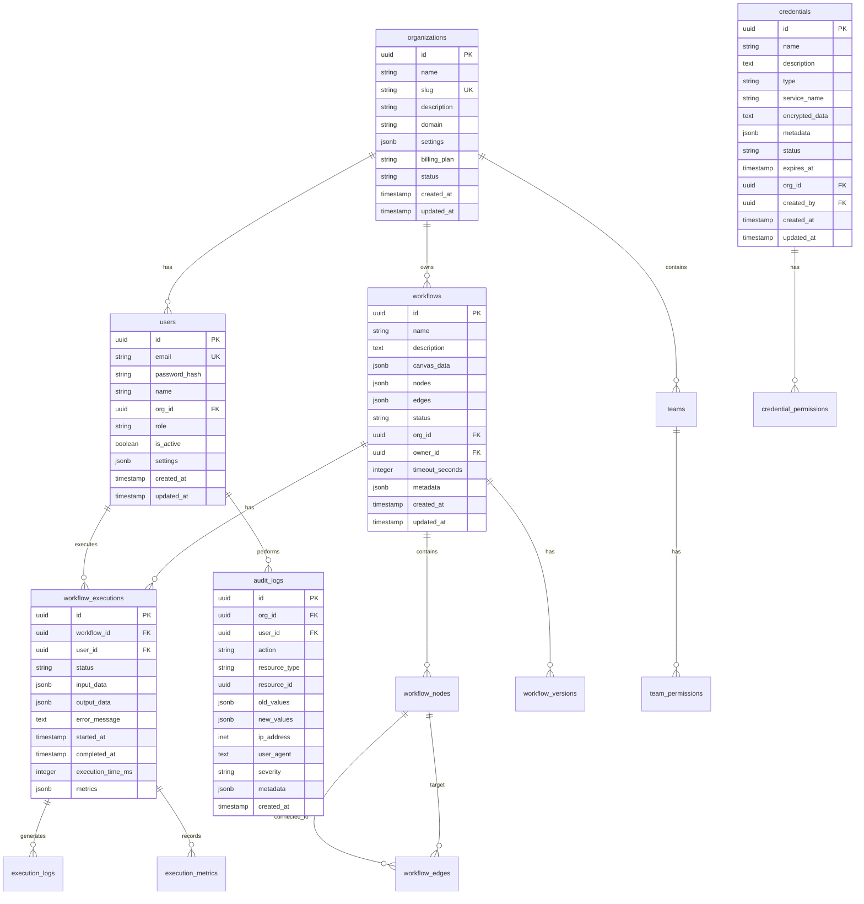

# Documentación Técnica - Silhouette Workflow Platform

## 🏗️ Arquitectura del Sistema

### Visión General de la Arquitectura

```
┌─────────────────────────────────────────────────────────────────────────────┐
│                          SILHOUETTE WORKFLOW PLATFORM                        │
├─────────────────────────────────────────────────────────────────────────────┤
│                                                                             │
│  ┌─ FRONTEND LAYER ─┐    ┌─ API GATEWAY ─┐    ┌─ LOAD BALANCER ─┐          │
│  │                  │    │                │    │                  │          │
│  │ 🖥️ Admin Portal   │    │ 🔐 Auth Layer  │    │ 🌐 NGINX         │          │
│  │ 📊 Analytics UI  │    │ 📋 API Routes  │    │ 🔄 SSL Term      │          │
│  │ 🎨 Workflow      │    │ ⚡ Rate Lim    │    │ 📊 Health Check  │          │
│  │   Designer       │    │ 🔍 Request     │    │ 🚀 Static Files  │          │
│  │                  │    │    Log         │    │                  │          │
│  └──────────────────┘    └────────────────┘    └──────────────────┘          │
│                                                                             │
│  ┌─ BACKEND SERVICES ─┐    ┌─ AI/ML ENGINE ─┐    ┌─ MESSAGE QUEUE ─┐        │
│  │                    │    │                │    │                  │        │
│  │ 🌐 API Server      │    │ 🤖 ML Training │    │ 🐰 RabbitMQ      │        │
│  │   (Express.js)     │    │ 🧠 Model       │    │ 💬 Async Jobs    │        │
│  │                    │    │   Inference    │    │ 📋 Workflow      │        │
│  │ 🔄 Workflow        │    │ 🎯 Predictions │    │   Queue          │        │
│  │   Engine           │    │ 📊 Analytics   │    │ 🔄 Retry Logic   │        │
│  │                    │    │ 🛠️ Auto-       │    │                  │        │
│  │ 🔐 Auth Service    │    │    scaling     │    │                  │        │
│  │                    │    │                │    │                  │        │
│  └────────────────────┘    └────────────────┘    └──────────────────┘        │
│                                                                             │
│  ┌─ DATA LAYER ─┐    ┌─ CACHE LAYER ─┐    ┌─ STORAGE LAYER ─┐              │
│  │              │    │               │    │                  │              │
│  │ 🗄️ PostgreSQL│    │ 💾 Redis       │    │ 📁 File Storage │              │
│  │   Database   │    │   Cluster      │    │   (S3/MinIO)    │              │
│  │              │    │               │    │                  │              │
│  │ 📊 User Data │    │ 🔄 Session     │    │ 📄 Workflow     │              │
│  │ 🔄 Workflows │    │   Store        │    │   Assets        │              │
│  │ 📋 Executions│    │               │    │                  │              │
│  │ 📈 Analytics │    │ ⚡ Query       │    │ 💾 Backups      │              │
│  │              │    │   Cache        │    │                  │              │
│  └──────────────┘    └───────────────┘    └──────────────────┘              │
│                                                                             │
│  ┌─ INFRASTRUCTURE LAYER ─┐    ┌─ MONITORING LAYER ─┐    ┌─ SECURITY ─┐    │
│  │                        │    │                    │    │            │    │
│  │ 🐳 Docker Containers  │    │ 📊 Prometheus      │    │ 🔐 Auth    │    │
│  │ 🚀 Orchestration      │    │ 📈 Grafana         │    │ 🔑 RBAC    │    │
│  │                        │    │                    │    │            │    │
│  │ 📦 Configuration      │    │ 🔍 Distributed     │    │ 🛡️ WAF    │    │
│  │   Management          │    │    Tracing         │    │            │    │
│  │                        │    │                    │    │ 📝 Audit   │    │
│  │ 🔄 Auto-scaling       │    │ 📋 Alert Manager   │    │ 📜 Compliance│   │
│  └────────────────────────┘    └────────────────────┘    └────────────┘    │
│                                                                             │
└─────────────────────────────────────────────────────────────────────────────┘
```

### Principios Arquitectónicos

#### 1. Microservicios Desacoplados
```typescript
// Cada servicio es independiente y escalable
interface ServiceArchitecture {
  backend_api: {
    responsibility: "Main API server, authentication, workflow management";
    technology: "Node.js + Express + TypeScript";
    scalability: "Horizontal with load balancer";
    dependencies: ["postgresql", "redis", "rabbitmq"];
  };
  ai_ml_service: {
    responsibility: "Machine learning, predictions, optimization";
    technology: "Python + FastAPI + scikit-learn/tensorflow";
    scalability: "GPU-enabled containers";
    dependencies: ["postgresql", "redis"];
  };
  analytics_service: {
    responsibility: "Data analytics, reporting, metrics";
    technology: "Node.js + Express + D3.js";
    scalability: "Separate analytics database";
    dependencies: ["elasticsearch", "redis"];
  };
  notification_service: {
    responsibility: "Email, SMS, push notifications";
    technology: "Node.js + Bull Queue + Nodemailer";
    scalability: "Event-driven with queues";
    dependencies: ["rabbitmq", "redis"];
  };
}
```

#### 2. Patrones de Diseño Implementados

**Circuit Breaker Pattern**
```typescript
// backend/src/patterns/circuit-breaker.ts
export class CircuitBreaker {
  private state: 'CLOSED' | 'OPEN' | 'HALF_OPEN' = 'CLOSED';
  private failureCount = 0;
  private lastFailureTime = 0;

  constructor(
    private threshold: number,
    private timeout: number,
    private action: () => Promise<any>
  ) {}

  async execute(): Promise<any> {
    if (this.state === 'OPEN') {
      if (Date.now() - this.lastFailureTime > this.timeout) {
        this.state = 'HALF_OPEN';
      } else {
        throw new Error('Circuit breaker is OPEN');
      }
    }

    try {
      const result = await this.action();
      this.onSuccess();
      return result;
    } catch (error) {
      this.onFailure();
      throw error;
    }
  }

  private onSuccess(): void {
    this.state = 'CLOSED';
    this.failureCount = 0;
  }

  private onFailure(): void {
    this.failureCount++;
    this.lastFailureTime = Date.now();

    if (this.failureCount >= this.threshold) {
      this.state = 'OPEN';
    }
  }
}
```

**Event Sourcing Pattern**
```typescript
// backend/src/patterns/event-sourcing.ts
export abstract class Event {
  constructor(
    public readonly id: string,
    public readonly type: string,
    public readonly timestamp: Date,
    public readonly aggregateId: string,
    public readonly version: number
  ) {}
}

export class WorkflowCreatedEvent extends Event {
  constructor(
    id: string,
    aggregateId: string,
    public readonly name: string,
    public readonly description: string,
    public readonly createdBy: string
  ) {
    super(id, 'WORKFLOW_CREATED', new Date(), aggregateId, 1);
  }
}

export class EventStore {
  private events: Event[] = [];

  async append(events: Event[]): Promise<void> {
    // Validar orden y versión
    for (const event of events) {
      await this.validateEvent(event);
    }
    
    // Persistir eventos
    this.events.push(...events);
    
    // Aplicar eventos a agregados
    await this.applyEvents(events);
  }

  async getEvents(aggregateId: string): Promise<Event[]> {
    return this.events.filter(e => e.aggregateId === aggregateId);
  }

  private async validateEvent(event: Event): Promise<void> {
    // Lógica de validación
  }

  private async applyEvents(events: Event[]): Promise<void> {
    // Aplicar eventos a proyecciones
  }
}
```

#### 3. Dependency Injection

```typescript
// backend/src/di/container.ts
export class DIContainer {
  private services = new Map();
  private singletons = new Map();

  register<T>(token: string, implementation: ClassConstructor<T> | T): void {
    this.services.set(token, implementation);
  }

  resolve<T>(token: string): T {
    // Intentar obtener singleton
    if (this.singletons.has(token)) {
      return this.singletons.get(token);
    }

    const service = this.services.get(token);
    if (!service) {
      throw new Error(`Service not registered: ${token}`);
    }

    // Si es una clase, crear instancia
    if (typeof service === 'function') {
      const instance = this.createInstance(service as ClassConstructor<T>);
      
      // Si es singleton, guardarlo
      if (this.isSingleton(service as ClassConstructor<T>)) {
        this.singletons.set(token, instance);
      }
      
      return instance;
    }

    return service;
  }

  private createInstance<T>(Constructor: ClassConstructor<T>): T {
    const dependencies = this.getDependencies(Constructor);
    const args = dependencies.map(dep => this.resolve(dep));
    return new Constructor(...args);
  }
}

// Usar container
const container = new DIContainer();
container.register('Database', PostgreSQLDatabase);
container.register('Cache', RedisCache);
container.register('AuthService', AuthService);

const authService = container.resolve<AuthService>('AuthService');
```

---

## 🔌 API Reference

### Estructura de la API

```yaml
api_version: "1.0.0"
base_url: "https://api.silhouette.tuempresa.com"
authentication:
  type: "Bearer Token (JWT)"
  headers:
    Authorization: "Bearer {token}"
    Content-Type: "application/json"

rate_limits:
  general: "1000 requests per 15 minutes"
  auth: "10 requests per 15 minutes"
  upload: "50 uploads per hour"

response_format:
  success: 
    success: true
    data: {}
    message: "Success message"
  error:
    success: false
    error: "ERROR_CODE"
    message: "Error description"
    details: {}
```

### Endpoints Principales

#### Authentication Endpoints

##### POST /api/auth/register
Registra un nuevo usuario en la plataforma.

**Request:**
```json
{
  "email": "user@empresa.com",
  "password": "SecurePassword123!",
  "name": "Juan Pérez",
  "orgName": "Mi Empresa S.L."
}
```

**Response 201:**
```json
{
  "success": true,
  "message": "Usuario registrado exitosamente",
  "data": {
    "user": {
      "id": "uuid-123",
      "email": "user@empresa.com",
      "name": "Juan Pérez",
      "role": "developer",
      "orgId": "org-uuid-123",
      "isActive": true
    },
    "tokens": {
      "accessToken": "jwt_access_token",
      "refreshToken": "jwt_refresh_token",
      "expiresIn": 28800
    }
  }
}
```

##### POST /api/auth/login
Autentica a un usuario y retorna tokens JWT.

**Request:**
```json
{
  "email": "user@empresa.com",
  "password": "SecurePassword123!"
}
```

**Response 200:**
```json
{
  "success": true,
  "message": "Login exitoso",
  "data": {
    "user": { /* user object */ },
    "tokens": { /* tokens object */ }
  }
}
```

##### POST /api/auth/refresh
Renueva el token de acceso usando el refresh token.

**Request:**
```json
{
  "refreshToken": "jwt_refresh_token"
}
```

**Response 200:**
```json
{
  "success": true,
  "data": {
    "accessToken": "new_jwt_access_token",
    "refreshToken": "new_jwt_refresh_token",
    "expiresIn": 28800
  }
}
```

#### Workflow Management Endpoints

##### GET /api/workflows
Obtiene la lista de workflows con filtros y paginación.

**Parameters:**
- `status` (optional): Filtrar por estado (draft, active, paused, archived)
- `name` (optional): Filtrar por nombre
- `page` (optional): Número de página (default: 1)
- `limit` (optional): Elementos por página (default: 20, max: 100)

**Response 200:**
```json
{
  "success": true,
  "data": {
    "workflows": [
      {
        "id": "workflow-uuid-123",
        "name": "Email Marketing Automation",
        "description": "Automated email campaigns",
        "status": "active",
        "createdAt": "2025-11-09T08:00:00Z",
        "updatedAt": "2025-11-09T08:30:00Z",
        "owner": {
          "id": "user-uuid-123",
          "name": "Juan Pérez"
        },
        "stats": {
          "executions": 150,
          "successRate": 0.94,
          "avgExecutionTime": 2.3
        }
      }
    ],
    "pagination": {
      "page": 1,
      "limit": 20,
      "total": 45,
      "pages": 3,
      "hasNext": true,
      "hasPrev": false
    }
  }
}
```

##### POST /api/workflows
Crea un nuevo workflow.

**Request:**
```json
{
  "name": "Data Processing Pipeline",
  "description": "Processes customer data daily",
  "canvasData": {
    "nodes": [ /* workflow nodes */ ],
    "edges": [ /* workflow connections */ ]
  },
  "tags": ["data", "automation", "daily"]
}
```

**Response 201:**
```json
{
  "success": true,
  "message": "Workflow creado exitosamente",
  "data": {
    "id": "workflow-uuid-456",
    "name": "Data Processing Pipeline",
    "status": "draft",
    "createdAt": "2025-11-09T08:00:00Z"
  }
}
```

##### POST /api/workflows/{id}/execute
Ejecuta un workflow.

**Request:**
```json
{
  "inputData": {
    "source": "customer_data.csv",
    "date": "2025-11-09"
  },
  "options": {
    "async": true,
    "priority": "normal"
  }
}
```

**Response 202:**
```json
{
  "success": true,
  "message": "Workflow execution started",
  "data": {
    "executionId": "exec-uuid-789",
    "status": "running",
    "estimatedDuration": "5-10 minutes"
  }
}
```

#### AI/ML Endpoints

##### POST /api/ai/ml/train
Inicia el entrenamiento de un modelo ML.

**Request:**
```json
{
  "modelType": "workflow-classifier",
  "name": "Custom Workflow Classifier",
  "trainingData": {
    "features": [
      "node_count",
      "execution_time",
      "resource_usage",
      "connector_types"
    ],
    "labels": ["simple", "medium", "complex"],
    "dataset": [
      {
        "features": [5, 120, 256, ["http", "database"]],
        "label": "simple"
      }
    ]
  },
  "hyperparameters": {
    "algorithm": "random_forest",
    "n_estimators": 100,
    "max_depth": 10
  }
}
```

**Response 200:**
```json
{
  "success": true,
  "data": {
    "trainingId": "train-uuid-123",
    "status": "training",
    "progress": 0.0,
    "estimatedTime": "15-30 minutes",
    "dashboardUrl": "/ai/training/train-uuid-123"
  }
}
```

##### GET /api/ai/ml/training/{trainingId}
Obtiene el estado de un entrenamiento.

**Response 200:**
```json
{
  "success": true,
  "data": {
    "trainingId": "train-uuid-123",
    "status": "completed",
    "progress": 1.0,
    "metrics": {
      "accuracy": 0.89,
      "precision": 0.87,
      "recall": 0.91,
      "f1_score": 0.89
    },
    "modelInfo": {
      "version": "1.0.0",
      "algorithm": "random_forest",
      "trainedAt": "2025-11-09T08:30:00Z",
      "size": "2.4 MB"
    }
  }
}
```

##### POST /api/ai/optimize
Optimiza un workflow usando IA.

**Request:**
```json
{
  "workflowId": "workflow-uuid-123",
  "workflowData": { /* workflow definition */ },
  "optimizationType": "performance",
  "algorithm": "genetic-algorithm",
  "constraints": {
    "maxExecutionTime": 300,
    "maxMemoryUsage": 512
  }
}
```

**Response 200:**
```json
{
  "success": true,
  "data": {
    "optimizationId": "opt-uuid-456",
    "originalScore": 0.73,
    "optimizedScore": 0.89,
    "improvements": {
      "executionTime": "-22%",
      "memoryUsage": "-18%",
      "cost": "-15%"
    },
    "optimizedWorkflow": { /* optimized workflow */ },
    "recommendations": [
      {
        "type": "performance",
        "description": "Implement parallel processing",
        "impact": "high"
      }
    ]
  }
}
```

#### Analytics Endpoints

##### GET /api/analytics/dashboard
Obtiene datos para el dashboard principal.

**Response 200:**
```json
{
  "success": true,
  "data": {
    "overview": {
      "totalWorkflows": 156,
      "activeWorkflows": 89,
      "totalExecutions": 12340,
      "successRate": 0.94,
      "avgExecutionTime": 2.3
    },
    "performance": {
      "responseTime": {
        "p50": 120,
        "p95": 450,
        "p99": 890
      },
      "throughput": {
        "requestsPerMinute": 145,
        "peakRPM": 280
      }
    },
    "trends": {
      "workflowGrowth": "+12%",
      "executionGrowth": "+8%",
      "userGrowth": "+5%"
    }
  }
}
```

##### GET /api/analytics/workflows/{id}/metrics
Obtiene métricas detalladas de un workflow.

**Response 200:**
```json
{
  "success": true,
  "data": {
    "workflowId": "workflow-uuid-123",
    "period": "last_30_days",
    "metrics": {
      "executions": {
        "total": 1450,
        "successful": 1367,
        "failed": 83,
        "successRate": 0.943
      },
      "performance": {
        "avgExecutionTime": 2.3,
        "minExecutionTime": 0.8,
        "maxExecutionTime": 15.2,
        "medianExecutionTime": 1.9
      },
      "resources": {
        "avgCpuUsage": 0.25,
        "avgMemoryUsage": 128,
        "avgNetworkUsage": 2.1
      }
    },
    "timeline": [
      {
        "date": "2025-11-01",
        "executions": 45,
        "successRate": 0.96,
        "avgTime": 2.1
      }
    ]
  }
}
```

### WebSocket API

#### Conexión
```javascript
const ws = new WebSocket('wss://api.silhouette.tuempresa.com/ws');

ws.onopen = () => {
  // Autenticar conexión
  ws.send(JSON.stringify({
    type: 'auth',
    token: 'jwt_token'
  }));
};

ws.onmessage = (event) => {
  const message = JSON.parse(event.data);
  handleRealtimeUpdate(message);
};
```

#### Eventos en Tiempo Real

##### Workflow Execution Updates
```json
{
  "type": "workflow_execution",
  "data": {
    "executionId": "exec-uuid-123",
    "workflowId": "workflow-uuid-456",
    "status": "running",
    "currentNode": "transform-data",
    "progress": 0.65,
    "startedAt": "2025-11-09T08:00:00Z",
    "eta": "2025-11-09T08:03:30Z"
  }
}
```

##### System Notifications
```json
{
  "type": "notification",
  "data": {
    "id": "notif-uuid-123",
    "level": "warning",
    "title": "High Memory Usage",
    "message": "Server memory usage is at 85%",
    "timestamp": "2025-11-09T08:00:00Z",
    "actions": [
      {
        "type": "scale_up",
        "label": "Scale Resources"
      }
    ]
  }
}
```

---

## 🗄️ Esquema de Base de Datos

### Entity Relationship Diagram



### Esquema Detallado

#### Tabla: users
```sql
CREATE TABLE users (
    id UUID PRIMARY KEY DEFAULT uuid_generate_v4(),
    email VARCHAR(255) UNIQUE NOT NULL,
    password_hash VARCHAR(255) NOT NULL,
    name VARCHAR(255) NOT NULL,
    org_id UUID NOT NULL REFERENCES organizations(id) ON DELETE CASCADE,
    role VARCHAR(50) NOT NULL DEFAULT 'viewer' CHECK (role IN ('super_admin', 'org_admin', 'tech_admin', 'analytics_admin', 'user_admin', 'developer', 'analyst', 'viewer')),
    is_active BOOLEAN NOT NULL DEFAULT true,
    last_login_at TIMESTAMP WITH TIME ZONE,
    settings JSONB DEFAULT '{}',
    created_at TIMESTAMP WITH TIME ZONE NOT NULL DEFAULT NOW(),
    updated_at TIMESTAMP WITH TIME ZONE NOT NULL DEFAULT NOW()
);

-- Índices
CREATE INDEX idx_users_org_id ON users(org_id);
CREATE INDEX idx_users_email ON users(email);
CREATE INDEX idx_users_role ON users(role);
CREATE INDEX idx_users_active ON users(is_active);

-- Triggers para updated_at
CREATE OR REPLACE FUNCTION update_updated_at_column()
RETURNS TRIGGER AS $$
BEGIN
    NEW.updated_at = NOW();
    RETURN NEW;
END;
$$ language 'plpgsql';

CREATE TRIGGER update_users_updated_at 
    BEFORE UPDATE ON users 
    FOR EACH ROW 
    EXECUTE FUNCTION update_updated_at_column();
```

#### Tabla: organizations
```sql
CREATE TABLE organizations (
    id UUID PRIMARY KEY DEFAULT uuid_generate_v4(),
    name VARCHAR(255) NOT NULL,
    slug VARCHAR(100) UNIQUE NOT NULL,
    description TEXT,
    domain VARCHAR(255),
    settings JSONB DEFAULT '{}',
    billing_plan VARCHAR(50) NOT NULL DEFAULT 'basic' CHECK (billing_plan IN ('basic', 'pro', 'enterprise')),
    status VARCHAR(20) NOT NULL DEFAULT 'active' CHECK (status IN ('active', 'suspended', 'cancelled')),
    limits JSONB DEFAULT '{}',
    created_at TIMESTAMP WITH TIME ZONE NOT NULL DEFAULT NOW(),
    updated_at TIMESTAMP WITH TIME ZONE NOT NULL DEFAULT NOW()
);

-- Índices
CREATE INDEX idx_organizations_slug ON organizations(slug);
CREATE INDEX idx_organizations_status ON organizations(status);

CREATE TRIGGER update_organizations_updated_at 
    BEFORE UPDATE ON organizations 
    FOR EACH ROW 
    EXECUTE FUNCTION update_updated_at_column();
```

#### Tabla: workflows
```sql
CREATE TABLE workflows (
    id UUID PRIMARY KEY DEFAULT uuid_generate_v4(),
    name VARCHAR(255) NOT NULL,
    description TEXT,
    canvas_data JSONB NOT NULL DEFAULT '{}',
    nodes JSONB NOT NULL DEFAULT '[]',
    edges JSONB NOT NULL DEFAULT '[]',
    status VARCHAR(20) NOT NULL DEFAULT 'draft' CHECK (status IN ('draft', 'active', 'paused', 'archived')),
    version INTEGER NOT NULL DEFAULT 1,
    org_id UUID NOT NULL REFERENCES organizations(id) ON DELETE CASCADE,
    owner_id UUID NOT NULL REFERENCES users(id) ON DELETE CASCADE,
    timeout_seconds INTEGER DEFAULT 3600,
    tags TEXT[] DEFAULT '{}',
    metadata JSONB DEFAULT '{}',
    created_at TIMESTAMP WITH TIME ZONE NOT NULL DEFAULT NOW(),
    updated_at TIMESTAMP WITH TIME ZONE NOT NULL DEFAULT NOW()
);

-- Índices
CREATE INDEX idx_workflows_org_id ON workflows(org_id);
CREATE INDEX idx_workflows_owner_id ON workflows(owner_id);
CREATE INDEX idx_workflows_status ON workflows(status);
CREATE INDEX idx_workflows_tags ON workflows USING GIN(tags);
CREATE INDEX idx_workflows_created_at ON workflows(created_at);
CREATE INDEX idx_workflows_updated_at ON workflows(updated_at);

-- Índice compuesto para queries comunes
CREATE INDEX idx_workflows_org_status ON workflows(org_id, status);

CREATE TRIGGER update_workflows_updated_at 
    BEFORE UPDATE ON workflows 
    FOR EACH ROW 
    EXECUTE FUNCTION update_updated_at_column();
```

#### Tabla: workflow_executions
```sql
CREATE TABLE workflow_executions (
    id UUID PRIMARY KEY DEFAULT uuid_generate_v4(),
    workflow_id UUID NOT NULL REFERENCES workflows(id) ON DELETE CASCADE,
    user_id UUID NOT NULL REFERENCES users(id) ON DELETE CASCADE,
    status VARCHAR(20) NOT NULL CHECK (status IN ('pending', 'running', 'completed', 'failed', 'cancelled')),
    input_data JSONB DEFAULT '{}',
    output_data JSONB DEFAULT '{}',
    error_message TEXT,
    error_stack TEXT,
    started_at TIMESTAMP WITH TIME ZONE DEFAULT NOW(),
    completed_at TIMESTAMP WITH TIME ZONE,
    execution_time_ms INTEGER,
    retry_count INTEGER DEFAULT 0,
    priority INTEGER DEFAULT 0,
    metrics JSONB DEFAULT '{}',
    metadata JSONB DEFAULT '{}'
);

-- Índices
CREATE INDEX idx_workflow_executions_workflow_id ON workflow_executions(workflow_id);
CREATE INDEX idx_workflow_executions_user_id ON workflow_executions(user_id);
CREATE INDEX idx_workflow_executions_status ON workflow_executions(status);
CREATE INDEX idx_workflow_executions_started_at ON workflow_executions(started_at);
CREATE INDEX idx_workflow_executions_completed_at ON workflow_executions(completed_at);

-- Índice compuesto para queries de analytics
CREATE INDEX idx_workflow_executions_workflow_status ON workflow_executions(workflow_id, status);
CREATE INDEX idx_workflow_executions_user_status ON workflow_executions(user_id, status);
```

#### Tabla: credentials
```sql
CREATE TABLE credentials (
    id UUID PRIMARY KEY DEFAULT uuid_generate_v4(),
    name VARCHAR(255) NOT NULL,
    description TEXT,
    type VARCHAR(50) NOT NULL CHECK (type IN ('api-key', 'oauth', 'password', 'certificate', 'token')),
    service_name VARCHAR(255) NOT NULL,
    encrypted_data TEXT NOT NULL,
    metadata JSONB DEFAULT '{}',
    status VARCHAR(20) NOT NULL DEFAULT 'active' CHECK (status IN ('active', 'inactive', 'expired', 'revoked')),
    expires_at TIMESTAMP WITH TIME ZONE,
    org_id UUID NOT NULL REFERENCES organizations(id) ON DELETE CASCADE,
    created_by UUID NOT NULL REFERENCES users(id) ON DELETE CASCADE,
    last_used_at TIMESTAMP WITH TIME ZONE,
    created_at TIMESTAMP WITH TIME ZONE NOT NULL DEFAULT NOW(),
    updated_at TIMESTAMP WITH TIME ZONE NOT NULL DEFAULT NOW()
);

-- Índices
CREATE INDEX idx_credentials_org_id ON credentials(org_id);
CREATE INDEX idx_credentials_service ON credentials(service_name);
CREATE INDEX idx_credentials_type ON credentials(type);
CREATE INDEX idx_credentials_status ON credentials(status);
CREATE INDEX idx_credentials_expires_at ON credentials(expires_at);

CREATE TRIGGER update_credentials_updated_at 
    BEFORE UPDATE ON credentials 
    FOR EACH ROW 
    EXECUTE FUNCTION update_updated_at_column();
```

#### Tabla: audit_logs
```sql
CREATE TABLE audit_logs (
    id UUID PRIMARY KEY DEFAULT uuid_generate_v4(),
    org_id UUID NOT NULL REFERENCES organizations(id) ON DELETE CASCADE,
    user_id UUID REFERENCES users(id) ON DELETE SET NULL,
    action VARCHAR(100) NOT NULL,
    resource_type VARCHAR(50) NOT NULL,
    resource_id UUID,
    old_values JSONB,
    new_values JSONB,
    ip_address INET,
    user_agent TEXT,
    session_id VARCHAR(255),
    severity VARCHAR(20) DEFAULT 'info' CHECK (severity IN ('debug', 'info', 'warning', 'error', 'critical')),
    metadata JSONB DEFAULT '{}',
    created_at TIMESTAMP WITH TIME ZONE NOT NULL DEFAULT NOW()
);

-- Índices
CREATE INDEX idx_audit_logs_org_id ON audit_logs(org_id);
CREATE INDEX idx_audit_logs_user_id ON audit_logs(user_id);
CREATE INDEX idx_audit_logs_action ON audit_logs(action);
CREATE INDEX idx_audit_logs_resource_type ON audit_logs(resource_type);
CREATE INDEX idx_audit_logs_created_at ON audit_logs(created_at);
CREATE INDEX idx_audit_logs_severity ON audit_logs(severity);

-- Índice compuesto para queries de compliance
CREATE INDEX idx_audit_logs_org_created ON audit_logs(org_id, created_at);
```

### Migraciones

#### Migración 001: Crear esquema base
```sql
-- Crear extensiones necesarias
CREATE EXTENSION IF NOT EXISTS "uuid-ossp";
CREATE EXTENSION IF NOT EXISTS "pg_stat_statements";
CREATE EXTENSION IF NOT EXISTS "btree_gin";

-- Habilitar RLS (Row Level Security)
ALTER TABLE users ENABLE ROW LEVEL SECURITY;
ALTER TABLE workflows ENABLE ROW LEVEL SECURITY;
ALTER TABLE workflow_executions ENABLE ROW LEVEL SECURITY;
ALTER TABLE credentials ENABLE ROW LEVEL SECURITY;

-- Políticas RLS para multitenancy
CREATE POLICY user_org_isolation ON users
    USING (org_id = current_setting('app.current_org_id', true)::uuid);

CREATE POLICY workflow_org_isolation ON workflows
    USING (org_id = current_setting('app.current_org_id', true)::uuid);

CREATE POLICY credential_org_isolation ON credentials
    USING (org_id = current_setting('app.current_org_id', true)::uuid);
```

#### Migración 002: Agregar analytics
```sql
-- Crear materialized views para analytics
CREATE MATERIALIZED VIEW workflow_analytics_daily AS
SELECT 
    DATE_TRUNC('day', started_at) as date,
    workflow_id,
    COUNT(*) as total_executions,
    COUNT(*) FILTER (WHERE status = 'completed') as successful_executions,
    COUNT(*) FILTER (WHERE status = 'failed') as failed_executions,
    AVG(execution_time_ms) as avg_execution_time,
    MAX(execution_time_ms) as max_execution_time,
    MIN(execution_time_ms) as min_execution_time
FROM workflow_executions
WHERE started_at >= NOW() - INTERVAL '30 days'
GROUP BY DATE_TRUNC('day', started_at), workflow_id;

-- Índice para materialized view
CREATE INDEX idx_workflow_analytics_daily_date ON workflow_analytics_daily(date);
CREATE INDEX idx_workflow_analytics_daily_workflow ON workflow_analytics_daily(workflow_id);

-- Función para refrescar materialized views
CREATE OR REPLACE FUNCTION refresh_workflow_analytics()
RETURNS void AS $$
BEGIN
    REFRESH MATERIALIZED VIEW CONCURRENTLY workflow_analytics_daily;
END;
$$ LANGUAGE plpgsql;

-- Programar refresh automático
SELECT cron.schedule('refresh-analytics', '0 */6 * * *', 'SELECT refresh_workflow_analytics();');
```

#### Migración 003: Optimizar performance
```sql
-- Crear índices adicionales para queries frecuentes
CREATE INDEX CONCURRENTLY idx_workflows_active_org 
ON workflows(org_id, status) 
WHERE status = 'active';

CREATE INDEX CONCURRENTLY idx_workflow_executions_recent 
ON workflow_executions(workflow_id, started_at DESC) 
WHERE started_at >= NOW() - INTERVAL '7 days';

-- Crear función para cleanup automático
CREATE OR REPLACE FUNCTION cleanup_old_data()
RETURNS void AS $$
BEGIN
    -- Limpiar logs antiguos (más de 90 días)
    DELETE FROM audit_logs 
    WHERE created_at < NOW() - INTERVAL '90 days';
    
    -- Limpiar ejecuciones fallidas antiguas (más de 30 días)
    DELETE FROM workflow_executions 
    WHERE status = 'failed' 
    AND completed_at < NOW() - INTERVAL '30 days';
    
    -- Limpiar ejecuciones de workflows archivados
    DELETE FROM workflow_executions we
    USING workflows w
    WHERE we.workflow_id = w.id
    AND w.status = 'archived'
    AND we.completed_at < NOW() - INTERVAL '7 days';
END;
$$ LANGUAGE plpgsql;

-- Programar cleanup semanal
SELECT cron.schedule('cleanup-old-data', '0 2 * * 0', 'SELECT cleanup_old_data();');
```

---

## 👥 Contributing Guidelines

### Proceso de Desarrollo

#### 1. Setup del Entorno de Desarrollo

```bash
# Clonar repositorio
git clone https://github.com/your-org/silhouette-workflow-platform.git
cd silhouette-workflow-platform

# Instalar dependencias
npm install

# Configurar variables de entorno
cp .env.example .env
# Editar .env con tus configuraciones

# Iniciar servicios de desarrollo
docker-compose -f docker-compose.dev.yml up -d

# Ejecutar migraciones
npm run db:migrate

# Iniciar aplicación en modo desarrollo
npm run dev
```

#### 2. Estructura de Ramas

```git
# Rama principal
main (production)
├── develop (integration)
│   ├── feature/workflow-designer
│   ├── feature/ai-integration
│   ├── feature/real-time-analytics
│   └── bugfix/memory-leak-fix
└── hotfix/critical-security-patch
```

#### 3. Convenciones de Commits

```bash
# Formato: type(scope): description

# Tipos permitidos:
feat:     Nueva funcionalidad
fix:      Corrección de bug
docs:     Documentación
style:    Cambios de formato (no afectan lógica)
refactor: Refactoring de código
test:     Agregar o modificar tests
chore:    Tareas de mantenimiento

# Ejemplos:
feat(auth): agregar autenticación OAuth2
fix(workflow): resolver memory leak en execution engine
docs(api): actualizar documentación de endpoints
test(ai): agregar tests para ML model training
```

### Estándares de Código

#### TypeScript Style Guide

```typescript
// 1. Nombres de interfaces y tipos
interface UserCredentials {
  email: string;
  password: string;
}

// 2. Usar const assertions para objetos literales
const DEFAULT_CONFIG = {
  timeout: 30000,
  retries: 3,
} as const;

// 3. Evitar any, usar unknown y type guards
function parseUser(data: unknown): User {
  if (!isUserData(data)) {
    throw new Error('Invalid user data');
  }
  return data;
}

// 4. Usar strict null checks
interface WorkflowNode {
  id: string;
  type: string;
  config?: NodeConfig; // opcional explícito
}

// 5. Preferir composición sobre herencia
abstract class BaseService {
  protected abstract execute(): Promise<any>;
}

class WorkflowService extends BaseService {
  protected async execute(): Promise<void> {
    // implementación específica
  }
}
```

#### Error Handling

```typescript
// 1. Crear tipos de error específicos
export class WorkflowError extends Error {
  constructor(
    message: string,
    public code: string,
    public workflowId?: string,
    public cause?: Error
  ) {
    super(message);
    this.name = 'WorkflowError';
  }
}

// 2. Usar Result pattern
export class Result<T> {
  constructor(
    public readonly success: boolean,
    public readonly data?: T,
    public readonly error?: string
  ) {}

  static ok<T>(data: T): Result<T> {
    return new Result(true, data);
  }

  static fail<T>(error: string): Result<T> {
    return new Result(false, undefined, error);
  }
}

// 3. Middleware de manejo global de errores
export const errorHandler = (
  error: Error,
  req: Request,
  res: Response,
  next: NextFunction
) => {
  if (error instanceof WorkflowError) {
    return res.status(400).json({
      success: false,
      error: error.code,
      message: error.message,
      workflowId: error.workflowId,
    });
  }

  // Log unexpected errors
  console.error('Unexpected error:', error);
  
  res.status(500).json({
    success: false,
    error: 'INTERNAL_SERVER_ERROR',
    message: 'An unexpected error occurred',
  });
};
```

#### Testing Standards

```typescript
// 1. Usar describe/it pattern con descripciones claras
describe('WorkflowService', () => {
  describe('createWorkflow', () => {
    it('should create a workflow with valid data', async () => {
      // Arrange
      const validWorkflowData = {
        name: 'Test Workflow',
        description: 'Test description',
        canvasData: {},
      };

      // Act
      const result = await workflowService.createWorkflow(validWorkflowData);

      // Assert
      expect(result.success).toBe(true);
      expect(result.data?.name).toBe('Test Workflow');
    });

    it('should fail with invalid canvas data', async () => {
      // Arrange
      const invalidData = {
        name: 'Test',
        canvasData: null, // invalid
      };

      // Act & Assert
      await expect(workflowService.createWorkflow(invalidData))
        .rejects
        .toThrow('Invalid canvas data');
    });
  });
});

// 2. Usar factory functions para datos de test
function createTestWorkflow(overrides: Partial<Workflow> = {}): Workflow {
  return {
    id: 'test-id',
    name: 'Test Workflow',
    description: 'Test Description',
    status: 'draft',
    orgId: 'org-id',
    ownerId: 'user-id',
    canvasData: {},
    nodes: [],
    edges: [],
    ...overrides,
  };
}

// 3. Mocking strategy
describe('WorkflowExecutor', () => {
  let mockDatabase: jest.Mocked<Database>;
  let mockCache: jest.Mocked<Cache>;

  beforeEach(() => {
    mockDatabase = createMockDatabase();
    mockCache = createMockCache();
  });

  it('should execute workflow with mocked dependencies', async () => {
    // Arrange
    const workflow = createTestWorkflow();
    mockDatabase.workflows.findById.mockResolvedValue(workflow);
    mockCache.get.mockResolvedValue(null);

    // Act
    const result = await workflowExecutor.execute(workflow.id);

    // Assert
    expect(result.success).toBe(true);
    expect(mockDatabase.workflows.findById).toHaveBeenCalledWith(workflow.id);
  });
});
```

### Pull Request Process

#### 1. Template de PR

```markdown
## 📝 Descripción
Breve descripción de los cambios realizados

## 🎯 Tipo de Cambio
- [ ] 🐛 Bug fix (cambio que resuelve un issue)
- [ ] ✨ Feature (nueva funcionalidad)
- [ ] 🔄 Refactor (cambio que no arregla un bug ni agrega feature)
- [ ] 📚 Documentation (cambios en documentación)
- [ ] ⚡ Performance (mejoras de performance)
- [ ] 🧪 Test (agregar o corregir tests)

## 🧪 Tests
- [ ] Tests unitarios agregados/actualizados
- [ ] Tests de integración agregados/actualizados
- [ ] Todos los tests pasan localmente

## 📋 Checklist
- [ ] Mi código sigue las convenciones del proyecto
- [ ] He hecho self-review de mi código
- [ ] He comentado código complejo
- [ ] He actualizado documentación relevante
- [ ] Mis cambios no generan nuevas warnings
- [ ] He agregado tests que prueban mi fix/feature
- [ ] Tests nuevos y existentes pasan localmente

## 📸 Screenshots (si aplica)

## 🔗 Issues Relacionados
Closes #issue_number
```

#### 2. Proceso de Review

```bash
# 1. Asignar reviewers apropiados
# 2. Ejecutar checks automatizados
# 3. Review de código
# 4. Testing manual
# 5. Approval y merge

# Comandos útiles para reviewers:
git checkout feature-branch
npm run test:integration
npm run test:e2e
npm run lint
npm run type-check
```

#### 3. Deployment Pipeline

```yaml
# .github/workflows/deploy.yml
name: Deploy to Production

on:
  push:
    branches: [main]

jobs:
  test:
    runs-on: ubuntu-latest
    steps:
      - uses: actions/checkout@v3
      - uses: actions/setup-node@v3
        with:
          node-version: '18'
      - run: npm ci
      - run: npm run test:unit
      - run: npm run test:integration
      - run: npm run test:e2e

  security:
    runs-on: ubuntu-latest
    steps:
      - uses: actions/checkout@v3
      - name: Security audit
        run: npm audit
      - name: CodeQL analysis
        uses: github/codeql-action/analyze

  deploy:
    needs: [test, security]
    runs-on: ubuntu-latest
    steps:
      - uses: actions/checkout@v3
      - name: Deploy to production
        run: |
          # Deploy commands
```

### Code Review Guidelines

#### Para Autores
```markdown
## ✅ DO:
- Escribir tests para nuevas funcionalidades
- Documentar APIs públicas
- Usar nombres descriptivos
- Mantener functions small y focused
- Usar TypeScript strict mode
- Escribir commits descriptivos
- Manejar errores apropiadamente
- Optimizar para readability

## ❌ DON'T:
- Merge sin tests
- Usar any sin justificación
- Commit con mensajes vagos
- Cambiar múltiples cosas en un PR
- Ignorar linter warnings
- Hardcodear valores
- Duplicar código
- Usar anti-patterns
```

#### Para Reviewers
```markdown
## ✅ Review Focus:
- Lógica de negocio
- Edge cases
- Performance implications
- Security concerns
- Code maintainability
- Test coverage
- Documentation
- Error handling

## 📝 Comments should be:
- Constructive and specific
- Offer solutions, not just problems
- Acknowledge good practices
- Suggest improvements politely
- Be actionable
```

---

## 🏁 Conclusión

Esta documentación técnica proporciona una guía completa para desarrolladores que trabajan con Silhouette Workflow Platform. Cubre:

### Resumen de la Documentación

#### Arquitectura
- ✅ Visión general del sistema
- ✅ Patrones de diseño implementados
- ✅ Principios arquitectónicos
- ✅ Dependency injection
- ✅ Microservicios desacoplados

#### API Reference
- ✅ Estructura de la API
- ✅ Endpoints principales
- ✅ Autenticación y autorización
- ✅ WebSocket API
- ✅ Ejemplos de requests/responses

#### Database Schema
- ✅ Entity Relationship Diagram
- ✅ Esquema detallado de tablas
- ✅ Índices y optimizaciones
- ✅ Migraciones
- ✅ Row Level Security (RLS)

#### Contributing Guidelines
- ✅ Proceso de desarrollo
- ✅ Estándares de código
- ✅ Testing standards
- ✅ Pull request process
- ✅ Code review guidelines

### Próximos Pasos para Desarrolladores

1. **Setup del entorno** siguiendo la guía de instalación
2. **Revisar la API reference** para entender los endpoints
3. **Estudiar el esquema de base de datos** para data modeling
4. **Seguir las contributing guidelines** para desarrollo
5. **Participar en code reviews** para mantener calidad
6. **Contribuir a la documentación** para mejorarla

### Recursos Adicionales

- 📖 [User Guide](user-guide.md)
- 🔧 [Admin Guide](admin-guide.md)
- 🚀 [Deployment Guide](deployment-guide.md)
- 🔒 [Security Guide](security-guide.md)
- 🧪 [Testing Documentation](testing-documentation.md)
- 💬 [Developer Discord](https://discord.gg/silhouette-dev)

**¡Esta documentación técnica te equipará para desarrollar, mantener y mejorar Silhouette Workflow Platform de manera profesional y eficiente! 🛠️**
