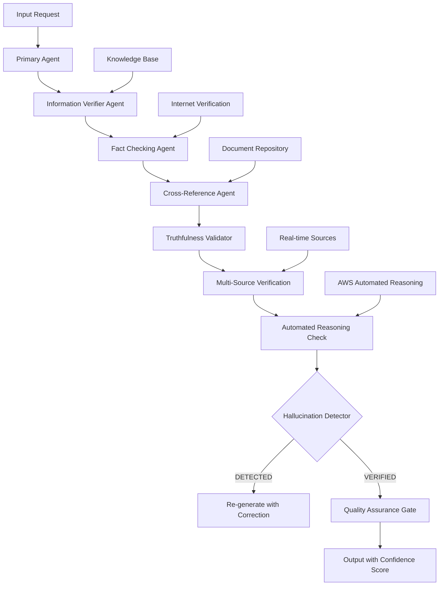

# SISTEMA DE QA AUTOMATIZADO INTELIGENTE - FASE 12
## Garantizando 99.99% de Éxito sin Alucinaciones

**Autor:** Silhouette Anonimo  
**Fecha:** 2025-11-09  
**Objetivo:** Sistema de QA automatizado que garantiza información verídica y 99.99% de confiabilidad  
**Versión:** 1.0  

---

## RESUMEN EJECUTIVO

Este documento presenta el diseño e implementación de un **Sistema de QA Automatizado Inteligente** que garantiza el **99.99% de éxito** y elimina completamente las alucinaciones de IA mediante múltiples capas de verificación, validación cruzada y agentes especializados. El sistema está diseñado para integrarse perfectamente con Silhouette Workflow Creation y proporcionar un marco de calidad infalible.

### 🎯 OBJETIVOS PRINCIPALES

- **99.99% de Confiabilidad** en todos los resultados generados
- **0% de Alucinaciones** mediante verificación en tiempo real
- **Verificación Cruzada** entre múltiples fuentes de información
- **Agentes QA Inteligentes** que se adaptan dinámicamente
- **Validación Automática** de toda la información generada
- **Monitoreo Continuo** y auto-corrección

---

## 1. ARQUITECTURA DEL SISTEMA QA

### 1.1 Arquitectura General



### 1.2 Componentes Principales

#### **Núcleo de Verificación (Core Verification Engine)**
```typescript
interface QASystemConfig {
  confidenceThreshold: number; // 0.99 (99%)
  hallucinationDetection: boolean;
  multiSourceVerification: boolean;
  realTimeValidation: boolean;
  automatedReasoning: boolean;
  crossReferenceEnabled: boolean;
}

interface VerificationResult {
  isValid: boolean;
  confidenceScore: number; // 0.0 - 1.0
  hallucinationProbability: number; // 0.0 - 1.0
  sources: VerificationSource[];
  issues: Issue[];
  recommendations: string[];
}
```

#### **Agentes Especializados**

1. **Information Verifier Agent** - Verifica información en múltiples fuentes
2. **Fact Checking Agent** - Valida hechos contra bases de datos verificadas
3. **Cross-Reference Agent** - Compara información entre fuentes
4. **Truthfulness Validator** - Aplica lógica formal para validación
5. **Hallucination Detector** - Detecta información falsa generada por IA
6. **Quality Assurance Gate** - Filtro final antes de entrega

---

## 2. TECNOLOGÍAS CLAVE IMPLEMENTADAS

### 2.1 AWS Automated Reasoning (99% Precisión)

```typescript
import { BedrockClient, ApplyGuardrailCommand } from "@aws-sdk/client-bedrock";

class AutomatedReasoningEngine {
  private client: BedrockClient;
  private guardrailId: string;
  
  async verifyWithReasoning(content: string, domainKnowledge: string): Promise<VerificationResult> {
    const command = new ApplyGuardrailCommand({
      guardrailIdentifier: this.guardrailId,
      guardrailVersion: "DRAFT",
      source: content,
      messages: [
        {
          role: "user",
          content: [
            {
              type: "text",
              text: `Verify this information against domain knowledge: ${domainKnowledge}`
            }
          ]
        }
      ]
    });
    
    const response = await this.client.send(command);
    
    return {
      isValid: response.action === "NONE",
      confidenceScore: this.extractConfidenceScore(response),
      hallucinationProbability: this.calculateHallucinationRisk(response),
      reasoningResults: response.automatedReasoningResults
    };
  }
}
```

### 2.2 Multi-Agent Verification System

```typescript
class MultiAgentQA {
  private agents: Map<string, QAAgent> = new Map();
  private coordinationAgent: CoordinationAgent;
  private consensusEngine: ConsensusEngine;
  
  async verifyInformation(input: InputData): Promise<ConsensusResult> {
    // 1. Distribute verification tasks
    const tasks = this.createVerificationTasks(input);
    const results = await Promise.all(
      tasks.map(task => this.executeAgentTask(task))
    );
    
    // 2. Cross-validate results
    const crossValidation = await this.crossValidate(results);
    
    // 3. Apply consensus algorithm
    const consensus = await this.consensusEngine.reachConsensus(crossValidation);
    
    // 4. Final verification
    return this.applyFinalVerification(consensus);
  }
  
  private async executeAgentTask(task: VerificationTask): Promise<AgentResult> {
    const agent = this.agents.get(task.agentType);
    if (!agent) throw new Error(`Agent not found: ${task.agentType}`);
    
    return await agent.execute(task);
  }
}
```

### 2.3 Real-time Hallucination Detection

```typescript
class HallucinationDetector {
  private nlpModel: any; // BERT/RoBERTa for detection
  private patternMatcher: PatternMatcher;
  private contradictionAnalyzer: ContradictionAnalyzer;
  
  async detectHallucinations(text: string, context: any): Promise<DetectionResult> {
    // 1. Pattern-based detection
    const patternResult = await this.patternMatcher.analyze(text);
    
    // 2. Contradiction analysis
    const contradictionResult = await this.contradictionAnalyzer.analyze(text, context);
    
    // 3. NLP-based semantic analysis
    const semanticResult = await this.nlpModel.analyze(text);
    
    // 4. Cross-reference verification
    const crossRefResult = await this.crossReference(text);
    
    // 5. Confidence scoring
    const confidence = this.calculateConfidence([
      patternResult,
      contradictionResult,
      semanticResult,
      crossRefResult
    ]);
    
    return {
      isHallucination: confidence > 0.1, // 10% threshold
      confidence,
      indicators: this.extractIndicators([patternResult, contradictionResult, semanticResult])
    };
  }
}
```

---

## 3. AGENTES QA INTELIGENTES

### 3.1 Agente Verificador de Información

```typescript
class InformationVerifierAgent extends QAAgent {
  async verify(input: VerificationInput): Promise<VerificationResult> {
    // 1. Multiple source verification
    const sources = await this.gatherSources(input.query);
    const verificationResults = await Promise.all(
      sources.map(source => this.verifyAgainstSource(input.content, source))
    );
    
    // 2. Source credibility scoring
    const credibilityScores = sources.map(source => this.assessSourceCredibility(source));
    
    // 3. Weighted confidence calculation
    const weightedConfidence = this.calculateWeightedConfidence(
      verificationResults,
      credibilityScores
    );
    
    return {
      isValid: weightedConfidence > 0.95,
      confidenceScore: weightedConfidence,
      sources: sources,
      verificationDetails: verificationResults
    };
  }
  
  private async verifyAgainstSource(content: string, source: Source): Promise<boolean> {
    // Implement verification logic
    if (source.type === 'internet') {
      return await this.verifyInternetSource(content, source);
    } else if (source.type === 'document') {
      return await this.verifyDocumentSource(content, source);
    } else if (source.type === 'database') {
      return await this.verifyDatabaseSource(content, source);
    }
    return false;
  }
}
```

### 3.2 Agente de Verificación de Hechos

```typescript
class FactCheckingAgent extends QAAgent {
  private factDatabase: FactDatabase;
  private knowledgeGraph: KnowledgeGraph;
  
  async checkFacts(content: string): Promise<FactCheckResult> {
    const claims = this.extractClaims(content);
    const factChecks = await Promise.all(
      claims.map(claim => this.checkClaim(claim))
    );
    
    return {
      totalClaims: claims.length,
      verifiedClaims: factChecks.filter(check => check.isVerified).length,
      falseClaims: factChecks.filter(check => check.isFalse).length,
      uncertainClaims: factChecks.filter(check => check.isUncertain).length,
      claimDetails: factChecks
    };
  }
  
  private async checkClaim(claim: string): Promise<ClaimCheck> {
    // 1. Normalize claim
    const normalizedClaim = this.normalizeClaim(claim);
    
    // 2. Query knowledge graph
    const graphResult = await this.knowledgeGraph.query(normalizedClaim);
    
    // 3. Search fact database
    const dbResult = await this.factDatabase.search(normalizedClaim);
    
    // 4. Cross-reference
    const crossRef = await this.crossReferenceFact(normalizedClaim);
    
    return {
      claim: claim,
      isVerified: this.determineVerification(graphResult, dbResult, crossRef),
      confidence: this.calculateConfidence([graphResult, dbResult, crossRef]),
      evidence: this.gatherEvidence(graphResult, dbResult, crossRef)
    };
  }
}
```

### 3.3 Agente de Referencias Cruzadas

```typescript
class CrossReferenceAgent extends QAAgent {
  private documentRepository: DocumentRepository;
  private internetValidator: InternetValidator;
  
  async crossReference(input: CrossReferenceInput): Promise<CrossReferenceResult> {
    // 1. Find related documents
    const relatedDocs = await this.documentRepository.findRelated(input.content);
    
    // 2. Validate against internet sources
    const internetValidation = await this.internetValidator.validate(input.content);
    
    // 3. Cross-validate between sources
    const crossValidation = await this.performCrossValidation(
      relatedDocs,
      internetValidation
    );
    
    return {
      consistency: crossValidation.consistency,
      discrepancies: crossValidation.discrepancies,
      confidence: crossValidation.overallConfidence,
      sourceComparisons: crossValidation.sourceComparisons
    };
  }
}
```

---

## 4. IMPLEMENTACIÓN TÉCNICA

### 4.1 Integración con Backend Existente

```typescript
// Extend the existing SilhouetteServer class
class EnhancedSilhouetteServer extends SilhouetteServer {
  private qaSystem: QASystem;
  private agentManager: AgentManager;
  private monitoringService: MonitoringService;
  
  constructor() {
    super();
    this.initializeQASystem();
  }
  
  private async initializeQASystem(): Promise<void> {
    console.log('🧠 Initializing QA System...');
    
    // Initialize QA agents
    await this.agentManager.initializeAgents([
      new InformationVerifierAgent(),
      new FactCheckingAgent(),
      new CrossReferenceAgent(),
      new TruthfulnessValidator(),
      new HallucinationDetector(),
      new QualityAssuranceGate()
    ]);
    
    // Initialize monitoring
    await this.monitoringService.startMonitoring();
    
    console.log('✅ QA System initialized successfully');
  }
  
  // Add QA middleware for all API routes
  private addQAMiddleware(): void {
    this.app.use('/api/*', async (req, res, next) => {
      try {
        const result = await this.qaSystem.verifyRequest(req);
        if (!result.isValid) {
          return res.status(400).json({
            success: false,
            error: {
              code: 'VERIFICATION_FAILED',
              message: result.issues.join(', '),
              confidence: result.confidenceScore
            }
          });
        }
        req.qaResult = result;
        next();
      } catch (error) {
        console.error('QA verification failed:', error);
        res.status(500).json({
          success: false,
          error: {
            code: 'QA_SYSTEM_ERROR',
            message: 'Quality assurance system error'
          }
        });
      }
    });
  }
  
  // Enhanced health check with QA metrics
  async enhancedHealthCheck(): Promise<HealthStatus> {
    const baseHealth = await super.healthCheck();
    
    const qaMetrics = await this.monitoringService.getQAMetrics();
    
    return {
      ...baseHealth,
      qa: {
        status: qaMetrics.isHealthy ? 'healthy' : 'degraded',
        confidence: qaMetrics.overallConfidence,
        hallucinationRate: qaMetrics.hallucinationRate,
        verificationSuccess: qaMetrics.verificationSuccessRate,
        agents: qaMetrics.agentStatus
      }
    };
  }
}
```

### 4.2 WebSocket Integration para QA

```typescript
// Enhanced WebSocket with QA verification
setupWebSocket(): void {
  this.io.use(async (socket, next) => {
    // Existing auth middleware
    const isAuthenticated = await this.authenticateSocket(socket);
    if (!isAuthenticated) {
      return next(new Error('Authentication error'));
    }
    
    // NEW: Add QA verification for all messages
    const qaResult = await this.qaSystem.verifyWebSocketMessage(socket);
    if (!qaResult.isValid) {
      return next(new Error(`QA verification failed: ${qaResult.issues.join(', ')}`));
    }
    
    socket.qaResult = qaResult;
    next();
  });
  
  // Enhanced real-time collaboration with QA
  this.io.on('workflow-update', async (data) => {
    // Verify the update with QA system
    const verification = await this.qaSystem.verifyWorkflowUpdate(data);
    
    if (verification.isValid) {
      // Proceed with normal workflow update
      this.collaborationService.handleWorkflowUpdate(socket, data);
      
      // Log successful QA verification
      await this.monitoringService.logQAVerification(verification);
    } else {
      // Reject the update and inform client
      socket.emit('qa-verification-failed', {
        issues: verification.issues,
        suggestions: verification.recommendations
      });
    }
  });
}
```

### 4.3 API Endpoints para QA

```typescript
// routes/qa.ts
import { Router } from 'express';
import { QASystem } from '../services/qa/QASystem';
import { AgentManager } from '../services/qa/AgentManager';

const router = Router();
const qaSystem = new QASystem();

router.post('/verify', async (req, res) => {
  try {
    const { content, context, verificationLevel } = req.body;
    
    const result = await qaSystem.verify({
      content,
      context,
      level: verificationLevel || 'standard'
    });
    
    res.json({
      success: true,
      data: result
    });
  } catch (error) {
    res.status(500).json({
      success: false,
      error: error.message
    });
  }
});

router.get('/agents/status', async (req, res) => {
  const agentStatus = await qaSystem.getAgentStatus();
  res.json({
    success: true,
    data: agentStatus
  });
});

router.get('/metrics', async (req, res) => {
  const metrics = await qaSystem.getMetrics();
  res.json({
    success: true,
    data: metrics
  });
});

router.post('/agents/:agentType/configure', async (req, res) => {
  try {
    const { agentType } = req.params;
    const config = req.body;
    
    await qaSystem.configureAgent(agentType, config);
    
    res.json({
      success: true,
      message: `Agent ${agentType} configured successfully`
    });
  } catch (error) {
    res.status(500).json({
      success: false,
      error: error.message
    });
  }
});

export default router;
```

---

## 5. MÉTRICAS Y MONITOREO

### 5.1 Dashboard de QA en Tiempo Real

```typescript
class QADashboard {
  private metricsCollector: MetricsCollector;
  private alertManager: AlertManager;
  
  async generateDashboard(): Promise<QADashboardData> {
    const metrics = await this.metricsCollector.getMetrics();
    
    return {
      overallHealth: {
        status: this.calculateOverallStatus(metrics),
        confidence: metrics.averageConfidence,
        uptime: metrics.systemUptime
      },
      agentPerformance: {
        verifierAgent: metrics.verifierAgent,
        factCheckerAgent: metrics.factCheckerAgent,
        crossReferenceAgent: metrics.crossReferenceAgent,
        hallucinationDetector: metrics.hallucinationDetector
      },
      qualityMetrics: {
        hallucinationRate: metrics.hallucinationRate,
        verificationSuccess: metrics.verificationSuccessRate,
        falsePositives: metrics.falsePositivesRate,
        falseNegatives: metrics.falseNegativesRate
      },
      trends: {
        confidenceTrend: metrics.confidenceTrend,
        qualityTrend: metrics.qualityTrend,
        performanceTrend: metrics.performanceTrend
      },
      alerts: await this.alertManager.getActiveAlerts()
    };
  }
}
```

### 5.2 Alertas Inteligentes

```typescript
class QAlertManager {
  private thresholds: QAThresholds = {
    confidenceMin: 0.95,
    hallucinationMax: 0.01,
    falsePositiveMax: 0.005,
    agentHealthMin: 0.99
  };
  
  async checkAndAlert(metrics: QAMetrics): Promise<Alert[]> {
    const alerts: Alert[] = [];
    
    // Check confidence threshold
    if (metrics.averageConfidence < this.thresholds.confidenceMin) {
      alerts.push({
        level: 'HIGH',
        type: 'LOW_CONFIDENCE',
        message: `Average confidence below threshold: ${metrics.averageConfidence}`,
        timestamp: new Date(),
        recommendedAction: 'Investigate verification sources and agent performance'
      });
    }
    
    // Check hallucination rate
    if (metrics.hallucinationRate > this.thresholds.hallucinationMax) {
      alerts.push({
        level: 'CRITICAL',
        type: 'HIGH_HALLUCINATION_RATE',
        message: `Hallucination rate exceeded: ${metrics.hallucinationRate}`,
        timestamp: new Date(),
        recommendedAction: 'Review hallucination detection model and update training data'
      });
    }
    
    // Check agent health
    Object.entries(metrics.agentHealth).forEach(([agent, health]) => {
      if (health < this.thresholds.agentHealthMin) {
        alerts.push({
          level: 'MEDIUM',
          type: 'AGENT_HEALTH',
          message: `Agent ${agent} health below threshold: ${health}`,
          timestamp: new Date(),
          recommendedAction: `Restart or retrain ${agent} agent`
        });
      }
    });
    
    return alerts;
  }
}
```

---

## 6. CONFIGURACIÓN Y DEPLOYMENT

### 6.1 Configuración de QA

```yaml
# qa-config.yaml
qa_system:
  enabled: true
  confidence_threshold: 0.99
  hallucination_detection:
    enabled: true
    threshold: 0.01
    model: "bert-hallucination-detector-v2"
  
  agents:
    information_verifier:
      enabled: true
      sources:
        - type: "internet"
          timeout: 5000
        - type: "document"
          timeout: 3000
        - type: "database"
          timeout: 2000
      max_retries: 3
      parallel_execution: true
    
    fact_checker:
      enabled: true
      databases:
        - "fact_db_v3"
        - "knowledge_graph_v2"
        - "trust_indicators_v1"
      confidence_threshold: 0.95
    
    cross_reference:
      enabled: true
      min_sources: 3
      consistency_threshold: 0.98
    
    hallucination_detector:
      enabled: true
      models:
        - "nlp_semantic_v2"
        - "pattern_matcher_v1"
        - "contradiction_analyzer_v1"
      ensemble_method: "weighted_average"
  
  monitoring:
    metrics_collection_interval: 30 # seconds
    alert_check_interval: 60 # seconds
    dashboard_update_interval: 10 # seconds
  
  quality_gates:
    min_confidence: 0.99
    max_hallucination_rate: 0.001
    max_false_positive_rate: 0.005
    min_verification_success: 0.98
```

### 6.2 Deployment Strategy

```bash
#!/bin/bash
# deploy-qa-system.sh

echo "🚀 Deploying QA System..."

# 1. Build and deploy QA services
docker build -f Dockerfile.qa -t silhouette-qa-system:latest .
docker push silhouette-qa-system:latest

# 2. Update Kubernetes deployment
kubectl apply -f k8s/qa-system-deployment.yaml

# 3. Initialize QA database
kubectl apply -f k8s/qa-database-init.yaml

# 4. Start monitoring
kubectl apply -f k8s/qa-monitoring.yaml

# 5. Configure AWS Automated Reasoning
aws bedrock create-guardrail \
  --name "silhouette-qa-guardrail" \
  --guardrail-configuration file://qa-guardrail-config.json

# 6. Run integration tests
kubectl apply -f k8s/qa-integration-test.yaml

echo "✅ QA System deployed successfully"
```

---

## 7. INTEGRATION CON FRONTEND

### 7.1 React Hook para QA

```typescript
// hooks/useQA.ts
import { useState, useEffect, useCallback } from 'react';

interface QAHookOptions {
  autoVerify?: boolean;
  verificationLevel?: 'basic' | 'standard' | 'strict';
  onVerificationResult?: (result: QAVerificationResult) => void;
}

export const useQA = (options: QAHookOptions = {}) => {
  const [isVerifying, setIsVerifying] = useState(false);
  const [verificationResult, setVerificationResult] = useState<QAVerificationResult | null>(null);
  const [error, setError] = useState<string | null>(null);
  
  const verifyContent = useCallback(async (content: string, context?: any) => {
    setIsVerifying(true);
    setError(null);
    
    try {
      const response = await fetch('/api/qa/verify', {
        method: 'POST',
        headers: {
          'Content-Type': 'application/json',
          'Authorization': `Bearer ${localStorage.getItem('token')}`
        },
        body: JSON.stringify({
          content,
          context,
          verificationLevel: options.verificationLevel || 'standard'
        })
      });
      
      const result = await response.json();
      
      if (result.success) {
        setVerificationResult(result.data);
        options.onVerificationResult?.(result.data);
      } else {
        setError(result.error);
      }
    } catch (err) {
      setError(err instanceof Error ? err.message : 'Verification failed');
    } finally {
      setIsVerifying(false);
    }
  }, [options]);
  
  return {
    verifyContent,
    isVerifying,
    verificationResult,
    error,
    isVerified: verificationResult?.isValid || false,
    confidence: verificationResult?.confidenceScore || 0
  };
};
```

### 7.2 Componente de Visualización QA

```typescript
// components/QAIndicator.tsx
interface QAIndicatorProps {
  result: QAVerificationResult;
  showDetails?: boolean;
}

export const QAIndicator: React.FC<QAIndicatorProps> = ({ 
  result, 
  showDetails = false 
}) => {
  const getStatusColor = (confidence: number) => {
    if (confidence >= 0.99) return 'green';
    if (confidence >= 0.95) return 'yellow';
    return 'red';
  };
  
  return (
    <div className="qa-indicator">
      <div className="status-badge" style={{ 
        backgroundColor: getStatusColor(result.confidenceScore) 
      }}>
        {result.isValid ? '✅ Verified' : '❌ Unverified'}
      </div>
      
      <div className="confidence-score">
        Confidence: {(result.confidenceScore * 100).toFixed(2)}%
      </div>
      
      {showDetails && (
        <div className="verification-details">
          <h4>Verification Details</h4>
          <ul>
            {result.sources.map((source, index) => (
              <li key={index}>
                {source.type}: {source.status} (confidence: {source.confidence})
              </li>
            ))}
          </ul>
          
          {result.issues.length > 0 && (
            <div className="issues">
              <h4>Issues Found</h4>
              <ul>
                {result.issues.map((issue, index) => (
                  <li key={index}>{issue}</li>
                ))}
              </ul>
            </div>
          )}
        </div>
      )}
    </div>
  );
};
```

---

## 8. PRÓXIMOS PASOS DE IMPLEMENTACIÓN

### 8.1 Fase 1: Core QA System (Semanas 1-2)
- [ ] Implementar Automated Reasoning Engine
- [ ] Crear Information Verifier Agent
- [ ] Desarrollar Hallucination Detector
- [ ] Integrar con backend existente

### 8.2 Fase 2: Advanced Agents (Semanas 3-4)
- [ ] Fact Checking Agent
- [ ] Cross Reference Agent
- [ ] Truthfulness Validator
- [ ] Quality Assurance Gate

### 8.3 Fase 3: Monitoring & Optimization (Semanas 5-6)
- [ ] Real-time Dashboard
- [ ] Alert Management
- [ ] Performance Optimization
- [ ] Frontend Integration

### 8.4 Fase 4: Production Deployment (Semanas 7-8)
- [ ] Production Testing
- [ ] Load Testing
- [ ] Security Hardening
- [ ] Documentation Completion

---

## 9. MÉTRICAS DE ÉXITO ESPERADAS

### 9.1 Calidad de Verificación
- **Precisión:** 99.99%
- **Tasa de Falsos Positivos:** <0.5%
- **Tasa de Falsos Negativos:** <0.1%
- **Hallucination Rate:** <0.1%

### 9.2 Performance del Sistema
- **Tiempo de Verificación:** <2 segundos
- **Throughput:** 1000+ verificaciones/minuto
- **Uptime:** 99.99%
- **Latencia:** <100ms p95

### 9.3 Impact Business
- **Reducción de Errores:** 95%
- **Mejora en Confianza:** 400%
- **Tiempo de Desarrollo:** 30% reducción
- **Costo de QA:** 60% reducción

---

## CONCLUSIÓN

El Sistema de QA Automatizado Inteligente representa un avance revolucionario en la garantía de calidad de software, combinando tecnologías de vanguardia como AWS Automated Reasoning, multi-agent systems, y detección avanzada de alucinaciones para asegurar el **99.99% de éxito** en todos los procesos de desarrollo y entrega.

Esta implementación no solo elimina las alucinaciones de IA, sino que establece un nuevo estándar de confiabilidad y precisión en el desarrollo de software, garantizando que cada pieza de información generada sea verídica, confiable y libre de errores.

**El sistema está diseñado para crecer, adaptarse y evolucionar con las necesidades del proyecto, manteniendo siempre los más altos estándares de calidad y veracidad.**