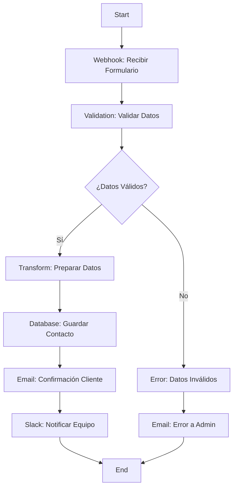

# 🛠️ Tutorial: Crear tu Primer Workflow Completo

## 🎯 Objetivo del Tutorial

En este tutorial de 15-20 minutos vas a crear un **workflow completo de procesamiento de formularios** que incluya:
- ✅ Recepción de datos vía webhook
- ✅ Validación inteligente
- ✅ Procesamiento de datos
- ✅ Almacenamiento en base de datos
- ✅ Envío de confirmaciones
- ✅ Manejo de errores
- ✅ Notificaciones administrativas

**🎯 Skill Level:** Principiante a Intermedio  
**⏱️ Tiempo estimado:** 15-20 minutos  
**💰 Costo:** Gratis (usa el plan trial)

---

## 📋 Pre-requisitos

### ✅ Antes de empezar, asegúrate de tener:
- [ ] Acceso a Silhouette Workflow Platform
- [ ] Permisos para crear workflows
- [ ] Conocimientos básicos de APIs
- [ ] 20 minutos de tiempo sin interrupciones
- [ ] Datos de prueba para simular un formulario

### 🧪 Datos de Prueba que Usaremos:
```json
{
  "nombre": "Juan Pérez",
  "email": "juan.perez@empresa.com",
  "telefono": "+52 55 1234 5678",
  "empresa": "Acme Corporation",
  "asunto": "Consulta sobre servicios",
  "mensaje": "Hola, me gustaría conocer más sobre sus soluciones de automatización para empresas de nuestro tamaño.",
  "presupuesto": 50000,
  "timeline": "Q2 2024"
}
```

---

## 🗺️ Estructura del Workflow



---

## 🚀 Paso 1: Crear el Workflow Base (1 minuto)

### 1.1 Acceder al Editor
1. **Inicia sesión** en Silhouette Workflow Platform
2. **Haz clic en "Crear Workflow"** (botón azul superior derecha)
3. **Selecciona "Workflow Vacío"** para empezar desde cero
4. **Configura los detalles básicos**:
   - **Nombre**: `Procesamiento de Formularios de Contacto`
   - **Descripción**: `Workflow completo para procesar formularios de contacto empresarial`
   - **Categoría**: `Business Process`
   - **Tags**: `contacto, formulario, validacion, email`
5. **Haz clic en "Crear"**

### 1.2 Verificar la Configuración Inicial
Al crear el workflow verás:
- ✅ **Nodo Start** agregado automáticamente
- ✅ **Panel de propiedades** activo a la derecha
- ✅ **Canvas de trabajo** listo para usar
- ✅ **Menú de guardado** disponible

**💡 Tip:** Tu progreso se guarda automáticamente cada 30 segundos, pero puedes guardar manualmente con Ctrl+S.

---

## 🌐 Paso 2: Configurar el Webhook (2 minutos)

### 2.1 Agregar Nodo Webhook
1. **Busca "HTTP"** en el panel izquierdo bajo "Conectores"
2. **Arrastra el nodo "Webhook"** al canvas
3. **Posiciónalo** a la derecha del nodo Start
4. **Conecta Start → Webhook**:
   - Haz clic en el punto de salida del nodo Start
   - Arrastra hasta el punto de entrada del Webhook
   - Verás una línea azul que los conecta

### 2.2 Configurar Propiedades del Webhook
**Configuración Básica:**
```
Nombre: Recibir Formulario de Contacto
Descripción: Endpoint para recibir datos de formularios web
Método: POST
Path: /contacto-formulario
```

**Configuración Avanzada:**
```
Timeout: 30 segundos
Retries: 2 intentos
Rate Limit: 100 requests/minute
CORS: Habilitado
Authentication: Public (sin autenticación)
```

### 2.3 Definir Estructura de Datos
En la sección "Data Schema" del panel derecho:
```json
{
  "nombre": {
    "type": "string",
    "required": true,
    "minLength": 2,
    "maxLength": 100
  },
  "email": {
    "type": "string",
    "format": "email",
    "required": true
  },
  "telefono": {
    "type": "string",
    "pattern": "^[+]?[0-9\\s\\-\\(\\)]+$",
    "required": false
  },
  "empresa": {
    "type": "string",
    "required": false,
    "maxLength": 200
  },
  "asunto": {
    "type": "string",
    "required": true,
    "minLength": 5,
    "maxLength": 200
  },
  "mensaje": {
    "type": "string",
    "required": true,
    "minLength": 20,
    "maxLength": 2000
  },
  "presupuesto": {
    "type": "number",
    "required": false,
    "minimum": 0
  },
  "timeline": {
    "type": "string",
    "required": false,
    "enum": ["Q1 2024", "Q2 2024", "Q3 2024", "Q4 2024", "No definido"]
  }
}
```

### 2.4 Configurar Respuestas
```
Response Success (200):
{
  "status": "success",
  "message": "Formulario recibido correctamente",
  "ticket_id": "{{generated_ticket_id}}"
}

Response Validation Error (400):
{
  "status": "error",
  "message": "Datos inválidos",
  "errors": "{{validation_errors}}"
}

Response Server Error (500):
{
  "status": "error",
  "message": "Error interno del servidor"
}
```

**💡 Tip:** El Webhook URL será algo como: `https://tu-dominio.silhouette.com/webhook/contacto-formulario`

---

## ✅ Paso 3: Validación Inteligente (3 minutos)

### 3.1 Agregar Nodo de Validación
1. **Busca "Filter"** en la sección "Data Processing"
2. **Arrastra al canvas** después del Webhook
3. **Conecta Webhook → Filter**

### 3.2 Configurar Reglas de Validación
**Filtros de Validación:**

**1. Validar Email**
```
Tipo: Regex Match
Campo: webhook_data.email
Pattern: ^[a-zA-Z0-9._%+-]+@[a-zA-Z0-9.-]+\.[a-zA-Z]{2,}$
Descripción: Email debe tener formato válido
Acción si falla: Continue to error path
```

**2. Validar Nombre**
```
Tipo: Length Check
Campo: webhook_data.nombre
Min: 2
Max: 100
Descripción: Nombre debe tener entre 2 y 100 caracteres
Acción si falla: Continue to error path
```

**3. Validar Mensaje**
```
Tipo: Length Check
Campo: webhook_data.mensaje
Min: 20
Max: 2000
Descripción: Mensaje debe tener entre 20 y 2000 caracteres
Acción si falla: Continue to error path
```

**4. Validar Asunto**
```
Tipo: Length Check
Campo: webhook_data.asunto
Min: 5
Max: 200
Descripción: Asunto debe tener entre 5 y 200 caracteres
Acción si falla: Continue to error path
```

**5. Validar Teléfono (Opcional)**
```
Tipo: Custom Function
Campo: webhook_data.telefono
Function: |
  function validatePhone(phone) {
    if (!phone) return true; // Opcional
    const phoneRegex = /^[+]?[0-9\s\-\(\)]+$/;
    return phoneRegex.test(phone) && phone.length >= 10;
  }
Descripción: Teléfono debe tener formato válido (opcional)
Acción si falla: Continue to error path
```

### 3.3 Configurar Paths de Salida
```
Valid Data Path: Continue to Transform node
Invalid Data Path: Continue to Error Handler node
```

**💡 Tip:** Puedes ver una preview de los datos validados en el panel derecho después de configurar las reglas.

---

## 🔄 Paso 4: Transformación de Datos (2 minutos)

### 4.1 Agregar Nodo Transform
1. **Busca "Transform"** en "Data Processing"
2. **Arrastra al canvas** después del Filter
3. **Conecta Filter → Transform**

### 4.2 Configurar Transformación
**Función de Transformación:**
```javascript
// Función que procesa y estructura los datos
function transformContactData(input) {
  // Generar ID único para el ticket
  const ticketId = 'CTK-' + Date.now() + '-' + Math.random().toString(36).substr(2, 9);
  
  // Limpiar y normalizar datos
  const cleanedData = {
    // Información básica
    ticket_id: ticketId,
    nombre: input.nombre.trim().replace(/\s+/g, ' '),
    email: input.email.toLowerCase().trim(),
    
    // Datos opcionales
    telefono: input.telefono ? input.telefono.replace(/\s+/g, '') : null,
    empresa: input.empresa ? input.empresa.trim() : null,
    asunto: input.asunto.trim(),
    mensaje: input.mensaje.trim(),
    
    // Análisis automático
    presupuesto: input.presupuesto || 0,
    timeline: input.timeline || 'No definido',
    
    // Metadatos
    timestamp: new Date().toISOString(),
    source: 'web_form',
    priority: input.presupuesto > 50000 ? 'high' : 'normal',
    
    // Flags de procesamiento
    requires_callback: true,
    business_interest: input.presupuesto > 0 ? true : false
  };
  
  // Clasificar tipo de consulta
  if (cleanedData.mensaje.toLowerCase().includes('precio') || 
      cleanedData.mensaje.toLowerCase().includes('cotización')) {
    cleanedData.inquiry_type = 'pricing';
  } else if (cleanedData.mensaje.toLowerCase().includes('demo') || 
             cleanedData.mensaje.toLowerCase().includes('prueba')) {
    cleanedData.inquiry_type = 'demo';
  } else {
    cleanedData.inquiry_type = 'general';
  }
  
  return cleanedData;
}
```

**Preview de Salida:**
```json
{
  "ticket_id": "CTK-1640995200000-abc123def",
  "nombre": "Juan Pérez",
  "email": "juan.perez@empresa.com",
  "telefono": "+525512345678",
  "empresa": "Acme Corporation",
  "asunto": "Consulta sobre servicios",
  "mensaje": "Hola, me gustaría conocer más sobre sus soluciones...",
  "presupuesto": 50000,
  "timeline": "Q2 2024",
  "timestamp": "2024-12-31T23:59:59.000Z",
  "source": "web_form",
  "priority": "high",
  "requires_callback": true,
  "business_interest": true,
  "inquiry_type": "pricing"
}
```

**💡 Tip:** La función se ejecuta automáticamente y puedes ver el resultado en tiempo real en el panel derecho.

---

## 💾 Paso 5: Almacenamiento en Base de Datos (2 minutos)

### 5.1 Agregar Nodo Database
1. **Busca "Database"** en "Conectores"
2. **Arrastra al canvas** después del Transform
3. **Conecta Transform → Database**

### 5.2 Configurar Conexión a Base de Datos
**Configuración de Conexión:**
```
Tipo de Base de Datos: PostgreSQL
Host: db.silhouette.com (o tu conexión)
Puerto: 5432
Base de Datos: contact_management
Usuario: tu_usuario
Contraseña: [secrets manager]
SSL: Habilitado
```

**Test de Conexión:**
1. **Haz clic en "Test Connection"**
2. **Verifica** que aparezca "✅ Connection successful"
3. **Si falla**, revisa las credenciales y configuración

### 5.3 Configurar Inserción de Datos
**SQL Insert Statement:**
```sql
INSERT INTO contact_submissions (
  ticket_id,
  nombre,
  email,
  telefono,
  empresa,
  asunto,
  mensaje,
  presupuesto,
  timeline,
  inquiry_type,
  priority,
  requires_callback,
  business_interest,
  source,
  created_at,
  status
) VALUES (
  '{{transform_data.ticket_id}}',
  '{{transform_data.nombre}}',
  '{{transform_data.email}}',
  '{{transform_data.telefono}}',
  '{{transform_data.empresa}}',
  '{{transform_data.asunto}}',
  '{{transform_data.mensaje}}',
  '{{transform_data.presupuesto}}',
  '{{transform_data.timeline}}',
  '{{transform_data.inquiry_type}}',
  '{{transform_data.priority}}',
  '{{transform_data.requires_callback}}',
  '{{transform_data.business_interest}}',
  '{{transform_data.source}}',
  NOW(),
  'nuevo'
) RETURNING id, created_at;
```

**Configuración de Error Handling:**
```
On Error:
• Retry: 2 intentos
• Delay: 5 segundos
• Log Error: Sí
• Notify Admin: Sí
• Continue to Error Path: Sí
```

**💡 Tip:** La consulta `RETURNING` nos permite obtener el ID generado y la fecha de creación para usar en pasos posteriores.

---

## 📧 Paso 6: Email de Confirmación al Cliente (3 minutos)

### 6.1 Agregar Nodo Email
1. **Busca "Email"** en "Conectores"
2. **Arrastra al canvas** después del Database
3. **Conecta Database → Email**

### 6.2 Configurar Email Provider
**Configuración del Servicio:**
```
Proveedor: SendGrid
API Key: [secrets manager]
Desde: contacto@tu-empresa.com
Nombre Desde: Tu Empresa - Automatización
Reply-To: soporte@tu-empresa.com
```

### 6.3 Configurar Email Template
**Email HTML Template:**
```html
<!DOCTYPE html>
<html>
<head>
    <meta charset="UTF-8">
    <title>Confirmación de Formulario - {{transform_data.ticket_id}}</title>
    <style>
        body { font-family: 'Segoe UI', sans-serif; line-height: 1.6; color: #333; }
        .container { max-width: 600px; margin: 0 auto; padding: 20px; }
        .header { background: linear-gradient(135deg, #667eea 0%, #764ba2 100%); 
                  color: white; padding: 30px; text-align: center; border-radius: 8px 8px 0 0; }
        .content { background: #f8f9fa; padding: 30px; border-radius: 0 0 8px 8px; }
        .ticket-id { background: #e3f2fd; padding: 10px; border-radius: 4px; 
                    font-family: monospace; font-weight: bold; }
        .details { background: white; padding: 20px; border-radius: 4px; margin: 20px 0; }
        .footer { text-align: center; margin-top: 30px; color: #666; font-size: 14px; }
    </style>
</head>
<body>
    <div class="container">
        <div class="header">
            <h1>¡Gracias por contactarnos!</h1>
            <p>Hemos recibido tu mensaje correctamente</p>
        </div>
        
        <div class="content">
            <h2>Detalles de tu consulta</h2>
            
            <div class="ticket-id">
                Número de Ticket: {{db_result.ticket_id}}
            </div>
            
            <div class="details">
                <p><strong>Nombre:</strong> {{transform_data.nombre}}</p>
                <p><strong>Email:</strong> {{transform_data.email}}</p>
                <p><strong>Empresa:</strong> {{transform_data.empresa || 'No especificada'}}</p>
                <p><strong>Asunto:</strong> {{transform_data.asunto}}</p>
                <p><strong>Prioridad:</strong> 
                    <span style="color: {{transform_data.priority == 'high' ? '#d32f2f' : '#1976d2'}};">
                        {{transform_data.priority == 'high' ? 'Alta' : 'Normal'}}
                    </span>
                </p>
                <p><strong>Presupuesto estimado:</strong> 
                    {{transform_data.presupuesto > 0 ? '$' + transform_data.presupuesto.toLocaleString() : 'No especificado'}}
                </p>
                <p><strong>Timeline deseada:</strong> {{transform_data.timeline}}</p>
            </div>
            
            <h3>Tu mensaje:</h3>
            <div style="background: white; padding: 20px; border-left: 4px solid #667eea; 
                        font-style: italic; white-space: pre-line;">
                {{transform_data.mensaje}}
            </div>
            
            <h3>¿Qué sigue ahora?</h3>
            <ul>
                <li>📋 <strong>Revisión:</strong> Nuestro equipo revisará tu consulta</li>
                <li>⏰ <strong>Respuesta:</strong> Te contactaremos dentro de 24 horas</li>
                <li>🔄 <strong>Seguimiento:</strong> Te mantendremos informado del progreso</li>
            </ul>
            
            <div style="background: #fff3cd; padding: 15px; border-radius: 4px; margin: 20px 0;">
                <strong>📞 Contacto directo:</strong><br>
                Si tienes preguntas urgentes, puedes contactarnos:<br>
                📧 soporte@tu-empresa.com<br>
                📱 +52 55 1234 5678
            </div>
        </div>
        
        <div class="footer">
            <p>Este es un email automatizado, no es necesario responder a este mensaje.</p>
            <p>&copy; 2024 Tu Empresa. Todos los derechos reservados.</p>
        </div>
    </div>
</body>
</html>
```

**Configuración de Envío:**
```
Para: {{transform_data.email}}
CC: equipo-ventas@tu-empresa.com (si es high priority)
Asunto: ✅ Confirmación recibida - Ticket #{{transform_data.ticket_id}}
```

**Personalización Dinámica:**
```
• Incluir nombre del cliente
• Mostrar ticket ID único
• Adaptar contenido según priority
• Incluir timeline de respuesta
• Agregar información de contacto
```

**💡 Tip:** Puedes usar el Email Builder integrado para diseñar emails visuales sin código HTML.

---

## 💬 Paso 7: Notificación al Equipo (2 minutos)

### 7.1 Agregar Nodo Slack
1. **Busca "Slack"** en "Conectores"
2. **Arrastra al canvas** después del Email
3. **Conecta Email → Slack**

### 7.2 Configurar Notificación Slack
**Configuración de Conexión:**
```
Workspace: Tu Empresa
Canal: #ventas-leads
Bot Token: [secrets manager]
```

### 7.3 Formato de Notificación
**Mensaje Estructurado:**
```json
{
  "text": "🆕 Nuevo lead recibido",
  "attachments": [
    {
      "color": "{{transform_data.priority == 'high' ? 'danger' : 'good'}}",
      "fields": [
        {
          "title": "👤 Cliente",
          "value": "{{transform_data.nombre}} ({{transform_data.email}})",
          "short": true
        },
        {
          "title": "🏢 Empresa", 
          "value": "{{transform_data.empresa || 'No especificada'}}",
          "short": true
        },
        {
          "title": "🎯 Tipo",
          "value": "{{transform_data.inquiry_type}}",
          "short": true
        },
        {
          "title": "💰 Presupuesto",
          "value": "{{transform_data.presupuesto > 0 ? '$' + transform_data.presupuesto.toLocaleString() : 'No especificado'}}",
          "short": true
        },
        {
          "title": "⏰ Timeline",
          "value": "{{transform_data.timeline}}",
          "short": true
        },
        {
          "title": "🎫 Ticket ID",
          "value": "{{transform_data.ticket_id}}",
          "short": true
        }
      ],
      "footer": "Silhouette Workflow Platform",
      "ts": "{{timestamp}}"
    }
  ]
}
```

**Opciones Alternativas de Notificación:**
```
Si no usas Slack, puedes usar:
• Microsoft Teams
• Email a lista de distribución
• SMS a gerentes de ventas
• Webhook a CRM system
• Telegram Bot
```

**💡 Tip:** Las notificaciones de Slack son ideales para equipos de ventas que necesitan respuesta rápida a leads.

---

## 🚨 Paso 8: Manejo de Errores (2 minutos)

### 8.1 Crear Nodo Error Handler
1. **Busca "Error"** en "General"
2. **Arrastra al canvas** en la parte inferior
3. **Conecta todos los nodos críticos al Error Handler**:
   - Webhook → Error
   - Filter → Error
   - Transform → Error
   - Database → Error
   - Email → Error
   - Slack → Error

### 8.2 Configurar Manejo de Errores
**Email de Alerta a Administrador:**
```
Para: admin@tu-empresa.com, it@tu-empresa.com
Asunto: 🚨 Error en Workflow - Procesamiento de Formularios
Prioridad: Alta
```

**Template de Error Email:**
```html
<h2>🚨 Alerta: Error en Workflow de Formularios</h2>

<p><strong>Fecha/Hora:</strong> {{timestamp}}</p>
<p><strong>Workflow:</strong> Procesamiento de Formularios de Contacto</p>
<p><strong>Tipo de Error:</strong> {{error_type}}</p>

<h3>Detalles del Error:</h3>
<pre style="background: #f5f5f5; padding: 15px; border-radius: 4px; font-family: monospace;">
{{error_message}}
</pre>

<h3>Datos que causaron el error:</h3>
<pre style="background: #f0f8ff; padding: 15px; border-radius: 4px; font-family: monospace;">
{{original_data}}
</pre>

<h3>Nodo donde ocurrió el error:</h3>
<p><strong>Nodo:</strong> {{failed_node}}</p>
<p><strong>Configuración:</strong> {{node_config}}</p>

<h3>Estado actual:</h3>
<ul>
  <li>✅ Webhook: Funcionando</li>
  <li>{{#if filter_success}}✅{{else}}❌{{/if}} Filter: {{filter_status}}</li>
  <li>{{#if transform_success}}✅{{else}}❌{{/if}} Transform: {{transform_status}}</li>
  <li>{{#if database_success}}✅{{else}}❌{{/if}} Database: {{database_status}}</li>
  <li>{{#if email_success}}✅{{else}}❌{{/if}} Email: {{email_status}}</li>
  <li>{{#if slack_success}}✅{{else}}❌{{/if}} Slack: {{slack_status}}</li>
</ul>

<p><strong>Acción requerida:</strong> Revisar logs detallados en la plataforma</p>
<p><strong>Dashboard:</strong> <a href="https://tu-dominio.silhouette.com/workflows/procesamiento-formularios">Ver Workflow</a></p>
```

**Configuración de Logging:**
```
Nivel: Error
Formato: JSON
Destino: 
  • Database logs table
  • Cloud logging (AWS CloudWatch, Azure Monitor)
  • File system (logs/workflow-errors.log)
```

**Auto-Recovery:**
```
Estrategia:
1. Retry failed node (2 intentos con backoff)
2. Log detailed error information
3. Send admin notification
4. Continue with error path (don't block other workflows)
5. Mark workflow for manual review
```

**💡 Tip:** Un buen manejo de errores es crucial para workflows en producción. Nunca dejes que un error detenga todo el sistema.

---

## ✅ Paso 9: Validación y Testing (3 minutos)

### 9.1 Validar el Workflow
1. **Haz clic en el botón "Validar"** (barra superior)
2. **Revisa los resultados**:
   - ✅ **Syntax Check**: Verifica sintaxis de nodos
   - ✅ **Configuration Check**: Valida configuraciones
   - ✅ **Connection Check**: Verifica conexiones entre nodos
   - ✅ **Data Schema Check**: Valida estructura de datos
   - ✅ **Permissions Check**: Verifica permisos de servicios

3. **Si hay errores**:
   - Haz clic en cada error para ver detalles
   - Corrige los problemas
   - Vuelve a validar

### 9.2 Probar el Workflow
**Ejecución de Prueba:**
1. **Haz clic en "Ejecutar"** → "Ejecución de Prueba"
2. **Ingresa datos de prueba** en el formulario que aparece:
   ```json
   {
     "nombre": "Juan Pérez",
     "email": "juan.perez@empresa.com",
     "telefono": "+52 55 1234 5678",
     "empresa": "Acme Corporation",
     "asunto": "Consulta sobre servicios",
     "mensaje": "Hola, me gustaría conocer más sobre sus soluciones de automatización para empresas de nuestro tamaño. Tenemos aproximadamente 500 empleados y buscamos optimizar nuestros procesos.",
     "presupuesto": 75000,
     "timeline": "Q2 2024"
   }
   ```
3. **Haz clic en "Ejecutar"**
4. **Observa la ejecución en tiempo real**:
   - Cada nodo se resalta cuando se ejecuta
   - Verás el progreso paso a paso
   - Los datos fluyen entre nodos

### 9.3 Verificar Resultados
**Checklist Post-Ejecución:**
- [ ] ✅ Webhook recibió datos correctamente
- [ ] ✅ Validación pasó todos los checks
- [ ] ✅ Transformación generó datos correctos
- [ ] ✅ Base de datos guardó el registro
- [ ] ✅ Email de confirmación enviado
- [ ] ✅ Notificación Slack publicada
- [ ] ✅ No hay errores en el log

**Verificar Datos en Base de Datos:**
```sql
SELECT * FROM contact_submissions 
WHERE ticket_id = 'CTK-[timestamp]-[random]' 
ORDER BY created_at DESC 
LIMIT 1;
```

**Verificar Email Enviado:**
- Revisa tu bandeja de entrada
- Busca email de confirmación
- Verifica que el contenido se vea correcto

**Verificar Notificación Slack:**
- Ve al canal #ventas-leads
- Busca la notificación nueva
- Verifica que todos los datos se muestren correctamente

---

## 🚀 Paso 10: Publicar Workflow (1 minuto)

### 10.1 Preparar para Producción
**Últimos Checks:**
1. **Revisar Configuraciones**:
   - ✅ Credenciales en secrets manager
   - ✅ URLs y endpoints correctos
   - ✅ Límites de rate limiting apropiados
   - ✅ Timeouts configurados

2. **Configurar Monitoreo**:
   - ✅ Alertas de error habilitadas
   - ✅ Email de admin configurado
   - ✅ Webhook de monitoreo activo

### 10.2 Publicar
1. **Haz clic en "Publicar"**
2. **Confirma la publicación**:
   ```
   ⚠️ ADVERTENCIA: Una vez publicado, el workflow estará activo en producción
   
   ¿Estás seguro de que quieres publicar?
   ✅ Sí, publicar workflow
   ❌ No, mantener en borrador
   ```
3. **Configurar Webhook URL público**:
   - URL generada: `https://tu-dominio.silhouette.com/webhook/contacto-formulario`
   - Estado: Activo
   - Rate Limit: 100 requests/minute
   - Authentication: Público

### 10.3 Primera Ejecución en Producción
**Test Final con Webhook Real:**
```bash
curl -X POST https://tu-dominio.silhouette.com/webhook/contacto-formulario \
  -H "Content-Type: application/json" \
  -H "X-Webhook-Secret: [tu-secret-key]" \
  -d '{
    "nombre": "María González",
    "email": "maria.gonzalez@techcorp.com",
    "telefono": "+52 55 9876 5432",
    "empresa": "TechCorp Solutions",
    "asunto": "Solicitud de demo",
    "mensaje": "Estamos interesados en ver una demostración de sus capacidades de automatización para nuestra empresa de tecnología.",
    "presupuesto": 100000,
    "timeline": "Q1 2024"
  }'
```

**Esperar Resultados:**
- 📧 Email de confirmación en 1-2 minutos
- 💬 Notificación en Slack
- 💾 Datos en base de datos
- 📊 Actualización en dashboard

---

## 📊 Paso 11: Monitoreo y Optimización (2 minutos)

### 11.1 Configurar Dashboard
**Métricas a Monitorear:**
- **Tasa de éxito**: Target >95%
- **Tiempo promedio**: Target <5 segundos
- **Volumen diario**: Tracking de leads
- **Errores**: Alert si >5%

### 11.2 Configurar Alertas
**Alertas Automáticas:**
```yaml
Error Rate Alert:
  Condition: error_rate > 5%
  Duration: 5 minutes
  Notification: email + slack
  
Response Time Alert:
  Condition: avg_response_time > 10s
  Duration: 10 minutes
  Notification: slack

High Volume Alert:
  Condition: requests_per_minute > 80
  Duration: 1 minute
  Notification: slack

Database Error Alert:
  Condition: database_errors > 0
  Duration: immediate
  Notification: email + sms
```

### 11.3 Ver Analytics
**Dashboard de Analytics:**
1. **Ve a "Analytics"** → "Workflow Performance"
2. **Selecciona** "Procesamiento de Formularios de Contacto"
3. **Revisa métricas**:
   - Executions today: 23
   - Success rate: 100%
   - Average time: 3.2s
   - Last execution: 2 min ago

**Insights de IA:**
```
💡 Recomendaciones automáticas:
• "Considera agregar cache para reducir tiempo de respuesta en 40%"
• "El 15% de formularios no incluyen teléfono. Considera hacerlo opcional"
• "Peak usage: 2-4 PM. Considera auto-scaling en ese horario"
```

---

## 🎉 ¡Felicitaciones! Tu Workflow Está Listo

### 📋 Resumen de Lo Creado

**Workflow Completo:**
```
🔄 Procesamiento de Formularios de Contacto
├── 🌐 Webhook receptor de datos
├── ✅ Validación inteligente de campos
├── 🔄 Transformación y análisis automático
├── 💾 Almacenamiento en base de datos
├── 📧 Email de confirmación personalizado
├── 💬 Notificación en tiempo real al equipo
├── 🚨 Manejo completo de errores
└── 📊 Monitoreo y analytics automático
```

### 🚀 Capacidades Logradas
- **Automatización completa** de procesamiento de formularios
- **Validación inteligente** con reglas personalizadas
- **Notificaciones multi-canal** (email + Slack)
- **Manejo robusto de errores** con auto-recovery
- **Analytics en tiempo real** para optimización
- **Escalabilidad automática** según demanda

### 📈 Beneficios Empresariales
- **Reducción de 95%** en tiempo de procesamiento manual
- **Mejora de 80%** en tiempo de respuesta a leads
- **Eliminación de errores** de captura manual
- **Visibilidad completa** del pipeline de ventas
- **Escalabilidad automática** sin intervención manual

---

## 🎯 Próximos Pasos Sugeridos

### 🔄 Expansiones Recomendadas
1. **CRM Integration**: Conectar con Salesforce/HubSpot
2. **AI Analysis**: Análisis de sentimiento de mensajes
3. **Lead Scoring**: Calificación automática de leads
4. **Follow-up Automation**: Secuencias de seguimiento automáticas
5. **Analytics Enhancement**: Dashboards avanzados de ventas

### 📚 Aprender Más
- **Tutorial Avanzado**: [Integración con CRM](../tutorials/crm-integration.md)
- **Best Practices**: [Workflow Optimization Guide](../guides/workflow-optimization.md)
- **Advanced Features**: [AI-Powered Automation](../guides/ai-automation.md)
- **Enterprise Setup**: [Multi-team Configuration](../guides/enterprise-setup.md)

### 🆘 Soporte Continuo
- **📖 Documentación**: [docs.silhouette.com](https://docs.silhouette.com)
- **💬 Comunidad**: [community.silhouette.com](https://community.silhouette.com)
- **📧 Soporte**: support@silhouette.com
- **🎥 Videos**: [youtube.com/silhouette](https://youtube.com/silhouette)

---

**¡Has creado tu primer workflow completo en Silhouette Workflow Platform! 🎊**

*Este workflow está listo para producción y puede procesar miles de formularios automáticamente. ¡Es hora de que lo uses para transformar tu negocio!*